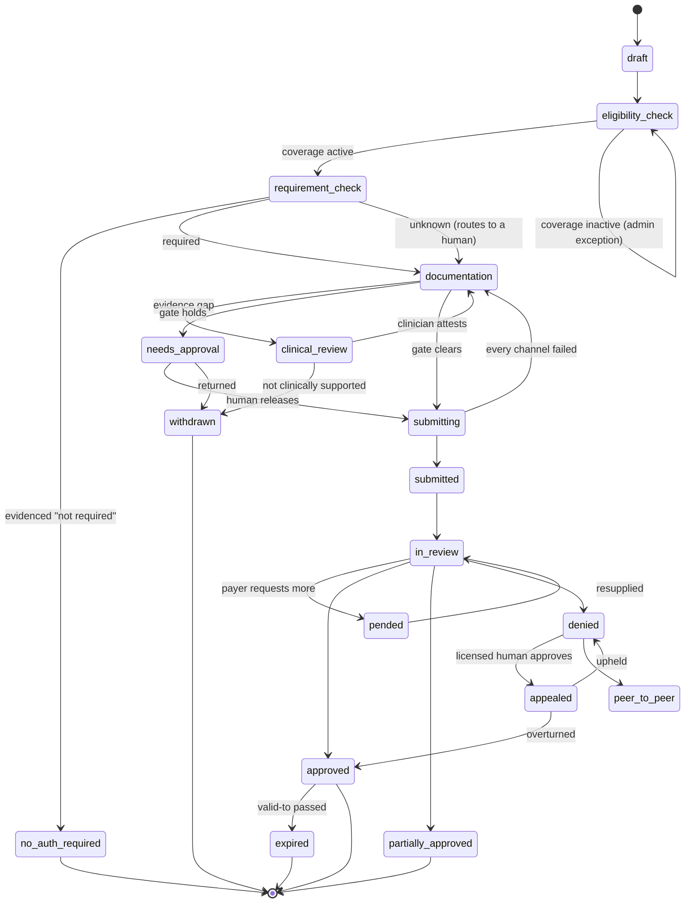

# 02 — Data Models

**The canonical model, its FHIR R4 and X12 278 mappings, and the constraints that encode the product's rules.**

TypeScript interfaces live in [`src/types/`](../src/types/). This document explains them, maps each to the standards, and records the design decisions that are not obvious from the shapes alone.

---

## 1. The organising idea: one canonical Case

Every document in the source folder converges on the same claim: **API, portal, voice and human are attempts on one case, never separate bots and never separate records.**

So `PriorAuthRequest` is the spine. A submission attempt is a child of it. A decision is a child of it. A voice transcript hangs off an attempt, not off a parallel "call" record. When the waterfall falls through from PAS to a portal to a phone call, the case id does not change — only the `attempts[]` array grows.

That single decision is what makes the audit trail, the patient journey and the KPI roll-ups possible without reconciliation.

---

## 2. Entity-relationship diagram

```mermaid
erDiagram
  TENANT ||--o{ APP_USER : "has"
  TENANT ||--o{ PATIENT : "owns"
  TENANT ||--o{ POLICY_CONFIG : "versions"
  TENANT ||--o{ CONNECTOR_INSTANCE : "configures"
  TENANT ||--o{ ORGANIZATION : "contains"

  ORGANIZATION ||--o{ PROVIDER : "employs"
  PATIENT ||--o{ COVERAGE : "insured by"
  PATIENT ||--o{ CLINICAL_DOCUMENT : "has chart"

  PAYER ||--o{ PAYER_PLAN : "offers"
  PAYER ||--o{ COVERAGE : "underwrites"
  PAYER ||--o{ PAYER_CRITERIA : "publishes"
  PAYER ||--o{ QUESTIONNAIRE : "publishes"
  PAYER_PLAN ||--o{ COVERAGE : "instantiated as"

  PAYER_CRITERIA ||--o{ CRITERION_ITEM : "contains"
  PAYER_CRITERIA ||--|| QUESTIONNAIRE : "gathered by"

  PRIOR_AUTH_REQUEST }o--|| PATIENT : "for"
  PRIOR_AUTH_REQUEST }o--|| COVERAGE : "under"
  PRIOR_AUTH_REQUEST }o--|| PAYER : "to"
  PRIOR_AUTH_REQUEST }o--|| PROVIDER : "ordered by"
  PRIOR_AUTH_REQUEST ||--o{ SERVICE_LINE : "requests"
  PRIOR_AUTH_REQUEST ||--o{ DIAGNOSIS : "supported by"
  PRIOR_AUTH_REQUEST ||--o{ CLINICAL_DOCUMENT : "attaches"
  PRIOR_AUTH_REQUEST ||--o{ SUBMISSION_ATTEMPT : "tries"
  PRIOR_AUTH_REQUEST ||--o| AI_ASSESSMENT : "assessed by"
  PRIOR_AUTH_REQUEST ||--o| QUESTIONNAIRE_RESPONSE : "answers"
  PRIOR_AUTH_REQUEST ||--o| DECISION : "receives"
  PRIOR_AUTH_REQUEST ||--o{ COMMUNICATION : "exchanges"
  PRIOR_AUTH_REQUEST ||--o{ TASK : "raises"
  PRIOR_AUTH_REQUEST ||--o{ AUDIT_EVENT : "records"

  SERVICE_LINE ||--o| SERVICE_LINE_DECISION : "adjudicated as"
  SUBMISSION_ATTEMPT }o--|| CONNECTOR_INSTANCE : "uses"
  SUBMISSION_ATTEMPT ||--o{ TRANSCRIPT_TURN : "if voice"

  AI_ASSESSMENT ||--o{ EXTRACTED_FACT : "extracts"
  AI_ASSESSMENT ||--o{ CRITERIA_MATCH : "scores"
  AI_ASSESSMENT ||--o{ MISSING_ITEM : "flags"
  AI_ASSESSMENT ||--|| CONFIDENCE_SCORE : "explains"
  AI_ASSESSMENT ||--o| DRAFT_LETTER : "drafts"
  CRITERIA_MATCH }o--|| CRITERION_ITEM : "against"

  DECISION ||--o{ REASON_CODE : "cites"
  DECISION ||--o{ APPEAL : "contested by"
  DECISION }o--o| APP_USER : "decided by (required if denial)"
  APPEAL }o--o| PEER_TO_PEER : "may escalate to"

  QUESTIONNAIRE ||--o{ QUESTIONNAIRE_ITEM : "asks"
  QUESTIONNAIRE_RESPONSE ||--o{ QUESTIONNAIRE_ANSWER : "contains"
  QUESTIONNAIRE_ANSWER }o--o| CLINICAL_DOCUMENT : "sourced from"

  CONNECTOR ||--o{ CONNECTOR_INSTANCE : "instantiated as"
  CONNECTOR ||--o| CONNECTOR_MAPPING : "translates via"
  CONNECTOR_MAPPING ||--o{ FIELD_MAPPING : "contains"
  CONNECTOR_INSTANCE ||--o{ CONNECTOR_ERROR : "logs"

  APP_USER ||--o{ NOTIFICATION : "receives"
  APP_USER }o--o{ ROLE : "holds"
  ROLE ||--o{ SCOPE : "grants"
  APP_USER ||--o{ TASK : "assigned"
```



---

## 3. Entity catalog

Sensitivity follows the blueprint's classes: **PHI** = protected health information, **CFG** = configuration, **SEC** = secret reference.

| Entity | File | Key fields | Class | Notes |
|---|---|---|---|---|
| `Tenant` | `core.ts` | id, tier, deploymentMode, region, **health** | CFG | Every tenant is a provider organisation; payers are counterparties, not tenants. `health` is counts and rates only — what a platform admin may see |
| `Organization` | `core.ts` | id, npi (type 2), taxId, type | CFG | |
| `Provider` | `core.ts` | id, npi (type 1), specialty, **isLicensedReviewer** | CFG | `isLicensedReviewer` gates attestation and appeal approval |
| `Patient` | `core.ts` | id, mrn, name, dob, sourceIds[] | **PHI** | `sourceIds` enables cross-EHR matching |
| `Payer` | `core.ts` | id, payerIdX12, regulatoryCategory, **capabilities**, automatedCallerPermitted | CFG | `capabilities` drives the waterfall |
| `PayerPlan` | `core.ts` | id, productLine, groupNumber | CFG | |
| `Coverage` | `core.ts` | id, memberId, status, period, verifiedAt, verificationRef | **PHI** | `verificationRef` is the 271 transaction id |
| `PriorAuthRequest` | `request.ts` | id, caseNumber, status, urgency, paRequired, requirementSource, requirementRef, idempotencyKey, version | **PHI** | The canonical Case |
| `ServiceLine` | `request.ts` | code, codeSystem, quantity, placeOfService, decision | **PHI** | Per-line adjudication supports partial approval |
| `Diagnosis` | `request.ts` | code (ICD-10-CM), rank | **PHI** | |
| `ClinicalDocument` | `request.ts` | type, loincCode, sha256, source, **requiredByRule** | **PHI** | `requiredByRule` enforces minimum-necessary |
| `SubmissionAttempt` | `request.ts` | channel, connectorId, outcome, externalRef, transcript | **PHI** | Failed attempts are kept, not discarded |
| `PayerCriteria` | `clinical.ts` | policyNumber, version, criteria[], requiredDocuments[], channelPreference, lastReviewedAt | CFG | `lastReviewedAt` exists because stale rules are the folder's named top risk |
| `Questionnaire` | `clinical.ts` | canonicalUrl, version, items[] | CFG | Da Vinci DTR |
| `QuestionnaireResponse` | `clinical.ts` | answers[] with source + confidence + span | **PHI** | Every answer carries provenance |
| `AIAssessment` | `clinical.ts` | extractedFacts, criteriaMatches, missingDocuments, confidence, recommendation, draftLetter, modelVersion, promptVersion | **PHI** | **No deny recommendation exists** |
| `Decision` | `clinical.ts` | outcome, decidedByName, authorizationNumber, validFrom/To, reasonCodes[], appealDeadline | **PHI** | The payer's act. `decidedByUserId` is always undefined — no persona here records one |
| `Appeal` | `clinical.ts` | level, status, dueAt, **approvedByUserId**, argument | **PHI** | Cannot be filed without clinical approval |
| `PeerToPeer` | `clinical.ts` | status, offeredSlots, scheduledAt, providerUserId | **PHI** | |
| `Communication` | `clinical.ts` | kind, direction, requestedItems[], dueAt | **PHI** | The RFI loop |
| `Task` | `platform.ts` | kind, reason, assignedRole, dueAt, resolution | **PHI** | `reason` is why a human was pulled in |
| `User` | `platform.ts` | roleIds[], providerId?, **adminScope?**, mfaEnrolled | CFG | `roleIds` is a list: one person may hold several personas, and gets the union |
| `Role` | `platform.ts` | scopes[], side, **canMakeClinicalDetermination** | CFG | Three of them. Exactly one is licensed |
| `Connector` | `platform.ts` | kind, interfaces[], capabilities[], standards[], onboardingDays | CFG | The shared registry |
| `ConnectorInstance` | `platform.ts` | **state**, credentialRef, successRate, errors[] | **SEC** | State, not "once authorized" |
| `ConnectorMapping` / `FieldMapping` | `platform.ts` | sourcePath → targetPath, transform, codeSystemFrom/To, status | CFG | Terminology translation |
| `AuditEvent` | `platform.ts` | actor, actorType, action, externalRef, **prevHash**, **hash** | **PHI-sensitive** | Append-only, hash-chained |
| `Notification` | `platform.ts` | eventType, title, body, link, requestId, channel[] | **CFG** | **Carries no PHI by construction**, on every channel |
| `NotificationPreference` | `platform.ts` | userId, eventType, email, webPush | CFG | Per user, per event. In-app has no toggle — it is the queue |
| `WebPushSubscription` | `platform.ts` | userId, permission, endpointRef, deviceLabel | CFG | The browser grant and service-worker endpoint |
| `PolicyConfig` | `platform.ts` | version, autoSubmitThreshold, killSwitch, trustByPayer, timers | CFG | Every change is a new version |
| `BillingAccount` | `platform.ts` | stripeCustomerRef, plan, licensedPhysicians, annualLicenseUsd, managedServicesMonthlyUsd, passThroughMode, paymentMethod | CFG | One Stripe customer per tenant |
| `PaymentMethod` | `platform.ts` | kind, brand, last4, stripeRef | CFG | A reference and a last four. The instrument lives at Stripe |
| `Invoice` / `InvoiceLine` | `platform.ts` | number, period, status, totalUsd, lines[] with kind + usageKind | CFG | Pass-through lines name the usage kind behind them |
| `UsageRecord` | `platform.ts` | kind, quantity, unitCostUsd, **requestId** | CFG | Names the case that caused the spend — how an invoice line audits down to cases |

---

## 4. Constraints the types enforce

These are the places where a product rule is expressed as a type or a service-layer guard rather than left to convention. They are the ones worth reviewing.

### 4.1 AI cannot deny

```ts
export type AIRecommendation =
  | "ready-to-submit"
  | "gather-more-documentation"
  | "escalate-clinical-review";
```

There is no fourth value. The agent can say *submit*, *get more*, or *ask a person*. It has no vocabulary for refusing care.

### 4.2 No determination originates in this portal

A determination is the **payer's** act. It arrives through a connector — a PAS `ClaimResponse`, an X12 278 response, a portal screen or a call outcome — and `Decision.decidedByUserId` is therefore always `undefined`: there is no user of ours to attribute it to. The service layer refuses any attempt to supply one:

```ts
// `payerReviewerName` names the payer's own medical director where the
// response gives one. It is never one of our users.
if (input.reviewerUserId) {
  throw new ApiError(
    "Determinations come from the payer. No persona in this portal may record one.",
    403, "not_permitted",
  );
}
```

And a denial unconditionally raises a task for the licensed Clinical Reviewer — a rule, not a configuration:

```ts
if (input.outcome === "denied") {
  store.tasks.unshift({ kind: "appeal-review", assignedRole: "clinical-reviewer", /* … */ });
  appendAudit({ action: "request.escalated", metadata: { policy: "no-ai-denial" } });
}
```

Earlier drafts enforced this by requiring a named licensed *payer* reviewer on our side. Removing the payer seat made the rule stronger rather than weaker: there is now no code path that produces a determination at all.

### 4.3 "Not required" is never a default

`RequirementResult.paRequired` is `boolean | "unknown"` — tri-state on purpose. The blueprint's instruction is literal: *never default to "not required"*. An unknown answer stays unknown and routes to a person, because a wrong "no" produces an unpaid claim months later.

### 4.4 Minimum necessary

`ClinicalDocument.requiredByRule: boolean`. Prior authorization is a HIPAA **payment** disclosure, so the treatment exception does not apply. The document fetch filters by the matched rule's required-document list, and the UI labels anything else as supplementary.

### 4.5 No duplicate authorization

`PriorAuthRequest.idempotencyKey` is `tenant + order + CPT`, with a unique constraint per tenant. `create` rejects a second open case for the same patient and code; `submit` rejects a second submission on a case that already has a successful attempt. The acceptance criterion in the source material is **zero**, not "low".

### 4.6 No PHI in notifications

`Notification` has `title`, `body`, `link` and `requestId` — and no name, code or diagnosis field to put PHI into. The fixtures read as deliberately vague ("One authorization case is waiting on a clinical judgement") because that is the requirement.

The rule does not relax by channel. `NotificationChannel` is `"in-app" | "email" | "web-push"`, and the same ID-only body goes to all three — an inbox and a lock screen are the two places PHI must never sit. `NotificationPreference` carries `email` and `webPush` per user per event type; in-app has no toggle because it *is* the queue. Turning a channel off suppresses delivery only: the event still fires, the in-app row still appears and the audit entry is still written, so a preference can never make something vanish from the record.

### 4.7 Derived, not stored

`RequestFlags` — `expiringSoon`, `slaBreached`, `slaAtRisk` — are computed from dates on every read. "Expiring soon" is valid-to before the scheduled service date; it cannot go stale because it is never written down.

### 4.8 Append-only audit

`AuditEvent.prevHash` chains to the previous entry's `hash`. The viewer verifies the chain on load and states the result. In production, `REVOKE UPDATE, DELETE ON audit_event FROM app_role`.

---

## 5. FHIR R4 mapping

NexAuthAI's canonical model is FHIR R4–shaped so that adapters translate once, at the edge, and the core never learns a vendor's dialect.

| NexAuthAI entity | FHIR R4 resource | Profile / IG | Notes |
|---|---|---|---|
| `Patient` | `Patient` | US Core 6.1.0 | `mrn` → `identifier[use=usual]`; `sourceIds` → additional `identifier` entries |
| `Provider` | `Practitioner` + `PractitionerRole` | US Core | NPI → `identifier[system=http://hl7.org/fhir/sid/us-npi]` |
| `Organization` | `Organization` | US Core | Type 2 NPI and tax ID as identifiers |
| `Payer` | `Organization` | US Core | Payer role; `payerIdX12` as an identifier |
| `PayerPlan` | `InsurancePlan` | — | |
| `Coverage` | `Coverage` | US Core | `memberId` → `subscriberId`; `status` → `Coverage.status`; period → `Coverage.period` |
| `PriorAuthRequest` (the order) | `ServiceRequest` (`DeviceRequest` for DME) | US Core | CPT in `code`; the originating order |
| `PriorAuthRequest` (the submission) | **`Claim`** with `use = preauthorization` | **Da Vinci PAS** | The PAS request bundle |
| `ServiceLine` | `Claim.item` | Da Vinci PAS | `code` → `item.productOrService` |
| `Diagnosis` | `Claim.diagnosis` + `Condition` | US Core | ICD-10-CM |
| `ClinicalDocument` | `DocumentReference` | US Core | `loincCode` → `type.coding`; `sha256` → `content.attachment.hash` |
| `Questionnaire` | `Questionnaire` | **Da Vinci DTR** | `canonicalUrl` + `version` |
| `QuestionnaireResponse` | `QuestionnaireResponse` | **Da Vinci DTR** | Answer provenance via `Provenance` |
| `Decision` | **`ClaimResponse`** | **Da Vinci PAS** | See §5.1 |
| `ServiceLineDecision` | `ClaimResponse.item.adjudication` | Da Vinci PAS | Carries partial approval |
| `Communication` (RFI) | **`Task`** (+ `Communication`) | **Da Vinci CDex** | Additional-information loop on a pended request |
| `Appeal` | `Claim` with a relationship to the prior `ClaimResponse` | — | Not well specified in the IGs; see §7 |
| `AIAssessment` | No FHIR resource | — | Internal. Its *inputs* and *outputs* are FHIR; the reasoning is ours |
| `AuditEvent` | `AuditEvent` | — | Our chain is richer than the FHIR resource; we expose a projection |
| `Task` (internal work) | `Task` | — | Distinct from the CDex payer Task — do not conflate |
| `Provenance` on every copy | `Provenance` | US Core | Which source, which connection, when |

### 5.1 Decision ↔ `ClaimResponse`

| NexAuthAI | `ClaimResponse` element |
|---|---|
| `outcome: approved` | `outcome = complete`, `disposition` describes it |
| `outcome: partially-approved` | `outcome = partial` |
| `outcome: denied` | `outcome = error` with `item.adjudication` reason codes |
| `outcome: pended` | `outcome = queued` + a CDex `Task` requesting more |
| `authorizationNumber` | `preAuthRef` |
| `validFrom` / `validTo` | `preAuthPeriod.start` / `.end` |
| `approvedUnits` | `item.adjudication[category=submitted-to-provider].value` |
| `reasonCodes[]` | `item.adjudication.reason` (CARC/RARC) |

**One rule worth stating explicitly:** internal `PaStatus` values are *never* conflated with FHIR status codes. `draft`, `clinical-review`, `needs-approval` and `peer-to-peer` have no FHIR equivalent and must not be squeezed into `ClaimResponse.outcome`. The business API (`/v1`) owns the case; `/fhir/R4` exposes only the interactions the IGs define.

---

## 6. X12 278 mapping

Where a payer has no FHIR surface, the same canonical model serialises to the HIPAA-mandated **X12 278 Health Care Services Review (005010)**. Both paths produce the same `Decision`.

| NexAuthAI | X12 278 segment / element | Loop |
|---|---|---|
| `Organization.npi` (requester) | `NM109` (XX qualifier) | 2010A — Utilization Management Organization / Requester |
| `Coverage.memberId` | `NM109` (MI qualifier) | 2010C — Subscriber |
| `Patient.lastName` / `firstName` | `NM103` / `NM104` | 2010C / 2010D |
| `Patient.dateOfBirth` | `DMG02` | 2010C / 2010D |
| `Provider.npi` (ordering) | `NM109` | 2010E — Requesting Provider |
| `PriorAuthRequest.urgency` | `UM02` certification type (`I` initial), `UM05` level of service (`03` = expedited) | 2000E |
| `ServiceLine.code` | `SV101-2` / `SV201-2` (CPT/HCPCS) | 2000F |
| `ServiceLine.quantity` | `SV104` / `HSD02` | 2000F |
| `ServiceLine.placeOfService` | `UM04` facility code | 2000E |
| `Diagnosis.code` | `HI01-2` (ABK principal, ABF secondary) | 2000E |
| `PriorAuthRequest.scheduledServiceDate` | `DTP03` (qualifier 472 service date) | 2000F |
| **`Decision.outcome`** | **`HCR01`** action code | 2000E/F |
| ↳ approved | `A1` certified in total | |
| ↳ partially-approved | `A6` modified | |
| ↳ denied | `A3` not certified | |
| ↳ pended | `A4` pended | |
| `Decision.authorizationNumber` | `REF02` with `BB` qualifier | 2000E |
| `Decision.validFrom` / `validTo` | `DTP03` qualifier `007` (effective) | 2000E |
| `Decision.reasonCodes[]` | `HCR03` reject reason code | 2000E/F |
| `SubmissionAttempt.externalRef` | `TRN02` trace number | 2000E |

### 6.1 What 278 cannot carry

**X12 278 has no attachment mechanism.** This is not an implementation shortcut — it is the standard's shape, and it is why the mock clearinghouse connector returns the note *"278 accepted. Note that 278 carries no attachments — supporting documents follow by the payer's stated channel."*

Practically: a 278 submission needs a second motion for documentation (fax, portal upload, or X12 275). The 275/277 claims-attachment compliance date is **26 May 2028**, and PA attachments are not finalised. Any plan that assumes 278 carries a clinical packet is wrong, and the waterfall must model documentation as a separate step on that lane.

### 6.2 Related transactions

| Transaction | Purpose | Where it appears |
|---|---|---|
| **270 / 271** | Eligibility inquiry and response | `Coverage.verifiedAt`, `verificationRef` |
| **276 / 277** | Claim status | Out of scope for PA; the second agent in the source material |
| **278** | Services review request / response | Above |
| **275** | Additional information / attachments | Compliance 26 May 2028 |
| **835** | Remittance | Out of scope |

---

## 7. Where the standards do not reach

Three gaps worth flagging, because designing around them is a real cost:

1. **Appeals have no implementation guide.** Neither PAS nor CDex specifies an appeal transaction. In practice an appeal is a new `Claim` referencing the prior `ClaimResponse`, or a portal/fax submission entirely outside the standards. Our `Appeal` entity is therefore **[Assumption]** — levels, deadlines and mechanics are ours.

2. **Peer-to-peer is entirely out of band.** Scheduling, slots and outcomes are phone and portal workflows. `PeerToPeer` is **[Assumption]**.

3. **CDex is the least mature of the four Da Vinci IGs.** Where a payer pends without CDex, the RFI loop degrades to a portal notice or a phone call — which is why `Communication` is channel-agnostic rather than modelled as a CDex Task.

---

## 8. Multi-tenancy and persistence

**One application, many tenants.** Isolation is three independent mechanisms, none of which is a second portal: a Keycloak realm per tenant (a token from one realm is not accepted by another), a scope check per endpoint, and `tenant_id` taken from the token — never from the URL — filtered by row-level security underneath. A dedicated or air-gapped customer runs this same schema in its own VPC with its own keys.

Every protected table carries `tenant_id` **first in the primary key**, with row-level security on:

```sql
CREATE TABLE prior_auth_request (
  tenant_id        uuid NOT NULL,
  request_id       uuid NOT NULL DEFAULT gen_random_uuid(),
  case_number      text NOT NULL,
  patient_id       uuid NOT NULL,
  coverage_id      uuid,
  payer_id         uuid NOT NULL,
  status           text NOT NULL,
  urgency          text NOT NULL CHECK (urgency IN ('standard','expedited')),
  pa_required      boolean,                              -- NULL means "unknown", never "no"
  requirement_source text,
  requirement_ref  text,
  rule_version     text,
  idempotency_key  text NOT NULL,
  decision_due_at  timestamptz,
  scheduled_service_date date,
  version          bigint NOT NULL DEFAULT 1,            -- optimistic concurrency (If-Match)
  created_at       timestamptz NOT NULL DEFAULT now(),
  updated_at       timestamptz NOT NULL DEFAULT now(),
  PRIMARY KEY (tenant_id, request_id),
  UNIQUE (tenant_id, idempotency_key)                    -- no duplicate authorization
);

ALTER TABLE prior_auth_request ENABLE ROW LEVEL SECURITY;
CREATE POLICY tenant_isolation ON prior_auth_request
  USING (tenant_id = current_setting('app.tenant_id')::uuid);

CREATE TABLE audit_event (
  tenant_id  uuid NOT NULL,
  event_id   bigint GENERATED ALWAYS AS IDENTITY,
  ts         timestamptz NOT NULL DEFAULT now(),
  actor      text NOT NULL,
  actor_type text NOT NULL CHECK (actor_type IN ('user','agent','system','payer')),
  action     text NOT NULL,
  target_type text NOT NULL,
  target_id  text NOT NULL,
  external_ref text,
  payload    jsonb,                                      -- IDs only, no PHI
  prev_hash  bytea,
  hash       bytea,
  PRIMARY KEY (tenant_id, event_id)
);
REVOKE UPDATE, DELETE ON audit_event FROM app_role;      -- write-once
```

Note `pa_required boolean` is **nullable**, and NULL means *unknown*. A three-valued column is the right shape here precisely because the two-valued one would invite a default.

Two storage layers, linked by provenance: **immutable raw** (what the source actually sent — the FHIR bundle, the 271, the call transcript) and a **derived normalized** case model. When a mapping turns out to be wrong, the raw copy is what lets you re-derive rather than re-fetch.

---

## 9. Case state machine



Transitions belong in one declarative table (`from, to, guard, actor_kind`) and the case service rejects anything not in it. Note that `requirement_check --> documentation` has **two** inbound paths — "required" and "unknown" — which is the state machine expressing §4.3.

---

## 10. Terminology

Translation happens at the adapter boundary, never in the core. The code systems in play:

| System | Used for | Translation needed |
|---|---|---|
| **ICD-10-CM** | Diagnoses on the request | Often from SNOMED CT (problem lists are SNOMED-coded; billing is ICD-10) |
| **CPT / HCPCS** | Services requested | Often from a local EHR order code (Epic EAP, athenaOne order type) |
| **LOINC** | Document types | Frequently absent on `DocumentReference` |
| **SNOMED CT** | Clinical findings in notes | → ICD-10-CM for the request |
| **RxNorm** | Medications | Term-type variation (SCD vs SBD) and local formulary IDs |
| **X12 payer IDs** | EDI routing | From a local payer ID via the registry |

`FieldMapping.codeSystemFrom` / `codeSystemTo` / `transform` record which `ConceptMap` applied, so a wrong mapping is diagnosable from the case rather than from a log.

---

*Next: `03-architecture.md`.*
