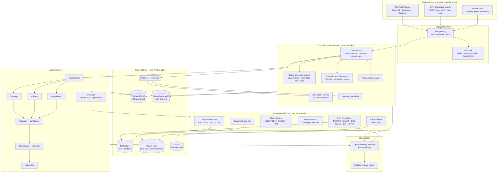
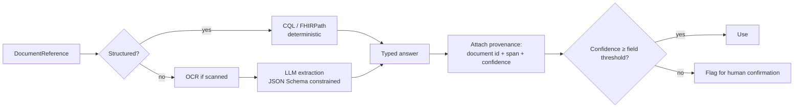
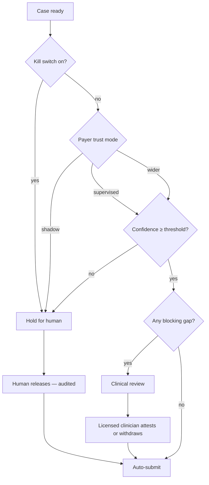

# 03 — Architecture

**How NexAuthAI is built in production: components, stack, security, AI design, and regulatory alignment.**

The prototype is a frontend with a fake service layer. This document describes the real system that service layer is a stand-in for.

---

## 1. High-level architecture



### 1.1 The seven design rules

1. **Canonical case, many channels.** API, portal, voice and human are attempts on one case. They never become separate bots or separate records.
2. **Core closed, connectors open.** A new EHR or payer is a new adapter implementing the contract in `05-connector-architecture.md`, never a branch in the engine.
3. **LLMs reason; rules decide.** Agents read, extract, classify and draft. Payer requirements, thresholds, routing and deadlines come from the versioned rules engine, which the model cannot override.
4. **Durable by default.** State changes and outbound events commit in one transaction (outbox). Workers are idempotent. Timers survive restarts. Nothing depends on a browser tab staying open.
5. **Two storage layers.** Immutable raw (what the source sent) and a derived normalized model, linked by provenance. When a mapping is wrong you re-derive rather than re-fetch.
6. **Connections are stateful.** Track and act on `active / degraded / failed / refresh-failed / expired / disconnected` — not on whether an OAuth flow once finished.
7. **Modular monolith first.** One deployable API with clear module boundaries, plus separately scaled workers. Split into services when load or team boundaries demand it, not before.

---

## 2. Request path: one GET AUTHORIZATION

```mermaid
sequenceDiagram
  autonumber
  participant EHR as EHR / Physician
  participant API as NexAuthAI API
  participant CS as Case service
  participant AG as Agent runtime
  participant RE as Rules engine
  participant CH as Clearinghouse
  participant PAY as Payer
  participant ST as Staff (HITL)

  EHR->>API: CDS Hooks order-sign / POST /v1/requests (Idempotency-Key)
  API->>CS: open case (draft → eligibility_check)
  CS->>AG: run(case)

  AG->>CH: X12 270 eligibility
  CH-->>AG: 271 — active, plan, member
  AG->>CS: record coverage + transaction ref

  AG->>PAY: CRD (CDS Hooks) — is PA required?
  PAY-->>AG: required + documentation rules + reference number
  Note over AG,CS: "Not required" is recorded with its source.<br/>"Unknown" routes to a human. Never a silent no.

  AG->>PAY: DTR — fetch Questionnaire
  PAY-->>AG: Questionnaire + CQL
  AG->>EHR: fetch only the required document types
  EHR-->>AG: DocumentReference[]
  AG->>AG: pre-populate; extract the rest with provenance

  AG->>RE: match criteria, score confidence
  RE-->>AG: confidence 0.93, components

  CS->>RE: gate — kill switch → trust mode → threshold
  alt held
    CS->>ST: approval task
    ST-->>CS: release (audited)
  end

  AG->>PAY: PAS Claim/$submit
  alt electronic fails
    AG->>PAY: portal (Playwright)
    alt portal fails
      AG->>PAY: voice (IVR + representative)
      alt voice fails
        AG->>ST: human task
      end
    end
  end
  PAY-->>AG: queued / pended / decision

  opt pended
    PAY->>AG: CDex Task — more information
    AG->>EHR: fetch that one document
    AG->>PAY: fulfil Task (no new submission)
  end

  PAY-->>CS: ClaimResponse — approved, auth #, valid dates
  CS->>EHR: write back auth #, dates, reference
  CS->>SCHED: start expiry timer vs scheduled service date
  CS-->>ST: notify (IDs only, no PHI)
```

---

## 3. Target production stack

| Layer | Choice | Why this one |
|---|---|---|
| **Frontend** | React 19 + React Router 7 + TypeScript + Tailwind, TanStack Query | Matches the existing `nexauth-ai-web` marketing site and reuses its design tokens — one palette across product and site |
| **API** | Node 22 + TypeScript (Fastify or NestJS), modular monolith | One language across UI, API and connectors. Connector authors are the same people as API authors |
| **Workflow** | PostgreSQL state machine + outbox + pg-boss/BullMQ workers | Cases span days to weeks with timers and human steps. Revisit **Temporal** when compensation logic outgrows this |
| **Database** | PostgreSQL 16 with row-level security | Cases, config, audit. RLS is the second line of tenant isolation under the API check |
| **FHIR store** | HAPI FHIR JPA (Apache-2.0) or Medplum | Do not write FHIR persistence yourself. Decide after a 3-day spike against HealthLake |
| **Identity** | Keycloak, realm per tenant | OIDC/OAuth2, MFA, SAML federation for health systems, and the SMART scopes the EHR connector presents |
| **Portal automation** | Playwright workers, isolated sessions | Screenshot evidence per step, change detection against a recorded baseline |
| **Voice** | Retell AI + SIP carrier | A channel adapter, never the system of record. We persist our own structured outcome |
| **LLM** | Frontier model under BAA; MedGemma self-hosted for the PHI-boundary tier | See §5.2 |
| **Object store** | S3 with SSE-KMS, customer-managed keys for the dedicated tier | Documents, recordings, transcripts, raw payloads |
| **Events** | Postgres outbox → EventBridge or SQS | At-least-once with no lost or phantom events |
| **Infra** | AWS (ECS Fargate, RDS Multi-AZ, S3, SQS, KMS, Secrets Manager), Terraform | HIPAA-eligible services only, under a BAA |
| **Observability** | OpenTelemetry → CloudWatch/Grafana, Sentry | **PHI scrubbed at the collector**, not at the dashboard |
| **Billing** | Stripe Billing + Invoicing | One Stripe customer per tenant; usage lines trace to the case ledger |

### 3.1 Deployment

| Concern | Choice |
|---|---|
| Compute | ECS Fargate: `api`, `worker-connectors`, `worker-portal` (Playwright, isolated), `worker-voice` |
| Network | Private subnets, VPC endpoints / PrivateLink. PHI does not cross the public internet where avoidable |
| Environments | `dev` (synthetic only) → `uat` (synthetic + payer sandboxes) → `prod`, in **separate AWS accounts** |
| Dedicated tier | The same Terraform deployed into the customer's VPC |
| DR | RDS automated backups + PITR; documented RTO/RPO; restore rehearsed quarterly, not assumed |

**[Assumption]** The source folder names AWS as the reference cloud and Keycloak and Stripe as fixed choices. The rest of this table is a recommendation consistent with the blueprint's ADRs, not a client decision.

---

## 4. Security and compliance

### 4.1 HIPAA posture

NexAuthAI operates as a **business associate** of each provider organisation. That shapes everything below.

| Control | Implementation |
|---|---|
| **BAAs** | Signed with **every** subprocessor that touches PHI — hosting, voice platform, model API, email if it ever carries more than a link — **before** any PHI enters |
| **Encryption at rest** | KMS, customer-managed keys for the dedicated tier; per-tenant S3 prefixes and keys |
| **Encryption in transit** | TLS 1.2+ everywhere, mTLS between internal services |
| **Minimum necessary** | Only payer-required documents leave the chart. PA is a *payment* disclosure, so the treatment exception does not apply |
| **Audit** | Append-only, hash-chained, with actor, action, target and external reference. Retention **commonly 6 years — confirm with counsel** |
| **Access** | MFA before any PHI; short-lived tokens; SMART scopes for EHR reads and write-backs |
| **No PHI in** | Notification payloads, logs, traces, metrics, or error reports. Scrubbed at the OTel collector |
| **Data ownership** | The practice owns its cases, rules and documents. Exportable on request. **Never used to train a cross-tenant model without explicit opt-in** |
| **Breach readiness** | Documented incident response with notification timelines; tabletop exercised |

### 4.2 Tenant isolation — four layers

1. **Identity** — one Keycloak realm per tenant. A user in Tenant A cannot be authorized into Tenant B.
2. **API** — `tenant_id` comes from the token, never from the URL or a request body.
3. **Database** — `tenant_id` first in every primary key, PostgreSQL RLS policies on every protected table.
4. **Storage** — per-tenant S3 prefixes, per-tenant KMS keys on the dedicated tier.

Cross-tenant read attempts must **fail at both the API and the database** in automated tests. One layer is a bug away from being the only layer.

### 4.3 RBAC and ABAC

**RBAC** handles the coarse grain: Keycloak realm roles map to token scopes (`request:read`, `clinical:decide`, `policy:write`, `connector:write`, `audit:read`).

**ABAC** handles what roles cannot express:

- An ordering physician sees **their own** orders (`request:read:own` — attribute: `orderingProviderId == user.providerId`).
- A payer user sees only submissions **to their own payer** (`payerId == user.payerId`).
- A patient sees only **their own** record (`patientId == user.patientId`).
- Each **agent role** gets only the tools and fields it needs — field-level policy, Cedar-style. The Coverage agent cannot read clinical notes; the Clinical agent cannot call the submission tool.

The platform-operator role has **no PHI scopes at all** — which the prototype implements literally, by omitting `request:read` from that role's scope list.

### 4.4 SOC 2 readiness

| Area | What it needs |
|---|---|
| Change management | PRs, reviews, CI gates, release approvals — all evidenced |
| Access reviews | Quarterly, with joiner/mover/leaver automation |
| Vendor management | BAA + security review per subprocessor, re-reviewed annually |
| Monitoring | Alerting on auth failures, tenant-isolation violations, connector state changes |
| Vulnerability management | Dependency scanning, annual pen test, documented remediation SLAs |
| BC/DR | Documented, tested, with evidence of the test |

Target **Type I before external market launch, Type II after**. Type II needs an observation window, so the clock starts the day controls go live, not the day you decide to pursue it.

---

## 5. AI design

### 5.1 The agent roles and their limits

| Role | Does | Tools | **May not** |
|---|---|---|---|
| **Orchestrator** | Opens the case, sequences roles, applies transitions | Case service | Skip the automation gate |
| **Coverage** | Eligibility, requirement determination, rule lookup | Clearinghouse, payer API, rules engine | Recall a payer rule from model memory |
| **Clinical** | Extract evidence, fill questionnaires, list gaps | FHIR read, document fetch, LLM extraction | **Judge medical necessity** |
| **Compliance** | Minimum-necessary check, consent, completeness, call-disclosure rules | Rules engine | Release PHI beyond the matched rule's list |
| **Decision** | Score confidence, consolidate findings | — | **Deny**, or override thresholds |
| **Submission** | Run the waterfall | Payer API, portal worker, voice adapter | Submit twice; call a payer that forbids automated callers |
| **Follow-Up** | Status, pends, write-back, expiry, appeal drafting | All read tools, EHR write-back | **File an appeal without human approval** |

### 5.2 Models and the PHI boundary

**Default.** A frontier model via API under a signed BAA, used for extraction, classification, summarisation and transcript structuring. Output is **always structured** (JSON Schema), validated before use, with source spans attached.

**Deterministic first.** If a FHIR field answers a question, no model call is made. DTR pre-population via CQL is deterministic; extraction is the fallback, not the default. This matters for cost, latency and auditability in that order.

**PHI-boundary option.** **MedGemma** (open weights) self-hosted inside the tenant's VPC for extraction, passing only de-identified structured results onward. For customers whose compliance posture requires that PHI never leave their infrastructure — the dedicated tier.

**Versioning.** Each case stores the model version, prompt version and rule version it was processed under. A case decided six months ago must be reproducible.

### 5.3 Document extraction



Every extracted fact carries `sourceDocumentId`, `sourceSpan` and `confidence`. A reviewer checks the agent rather than trusting it — which is also what makes a correction useful as training signal.

### 5.4 Criteria matching

The model does **not** decide whether criteria are met. It produces, per criterion, one of `met` / `not-met` / `unclear`, with evidence and a confidence figure. The *rules engine* then decides what that combination means for routing. A `not-met` on a required criterion routes to a human; it never produces a refusal.

### 5.5 Confidence, and why it is a vector

A single number is not reviewable. The score is a weighted sum of six named components, all stored:

| Component | Weight | Signal |
|---|---|---|
| Rule match | 0.20 | Exact payer + plan + code policy found, vs a fallback |
| Packet completeness | 0.25 | Required items present / required |
| Extraction certainty | 0.20 | Minimum field confidence across answers |
| Identity match | 0.10 | Patient, member and provider identifiers agree across sources |
| Route reliability | 0.10 | Historical success of this channel for this payer |
| Prior outcomes | 0.15 | Approval rate for this payer + code in this tenant |

Start with fixed weights, calibrate in Shadow mode against staff decisions, and **report calibration — predicted vs actual — per payer before any payer leaves Shadow**. A score that is not calibrated is decoration.

### 5.6 Human-in-the-loop — the gate



Three checks in a fixed order, and the audit entry names which one held the case. Autonomy is granted **per payer, per action type, per workflow** — never all at once, and promotion to wider autonomy requires explicit written sign-off.

### 5.7 Explainability

For any case, a reviewer can see: which policy version matched, which criteria were assessed and how, which document and span supports each fact, what the confidence components were, which channel carried the submission and with what reference number, and who approved what. That is the artifact an appeal, a payer dispute or a regulator will ask for.

### 5.8 Model monitoring

| Metric | Why | Action on drift |
|---|---|---|
| Field-level extraction accuracy | Bad packets cause denials | Re-prompt, re-tune, or make the field human-only |
| Requirement-check accuracy | A wrong "not required" is an unpaid claim | Fall back to the matrix; raise the payer's review priority |
| Confidence calibration per payer | Over-confidence is how automation hurts people | Return that payer to Shadow |
| Duplicate submission rate | Must be **zero** | Halt and investigate; this is not a tunable |
| Human override rate | Where the agent is wrong, by payer and by criterion | Feeds the eval set |
| Denial rate vs baseline | The nH Predict lesson | Investigate any sustained rise |

**Workflow replay:** re-run historical cases through a new rule, prompt or model version before promoting it. Golden test calls per IVR map, re-run when a payer changes its phone tree.

### 5.9 What the AI never does

Stated plainly because it is the most-repeated sentence in the source material:

- **It never issues a denial.** No code path exists.
- **It never decides medical necessity.** It reports facts and gaps.
- **It never auto-approves an appeal.** A licensed human approves filing.
- **It never calls a payer that forbids automated callers**, and never records a call without checking the state's one- or two-party consent rule.

---

## 6. Regulatory alignment — CMS-0057-F

The **CMS Interoperability and Prior Authorization Final Rule (CMS-0057-F)**, finalised January 2024, requires impacted payers to expose four FHIR APIs.

### 6.1 The four APIs

| API | Requirement | Deadline |
|---|---|---|
| **Patient Access API** (expanded) | Patients pull their PA status and history via their own app | **1 Jan 2027** |
| **Provider Access API** | Payers share claims, encounters and PA data with in-network providers | **1 Jan 2027** |
| **Payer-to-Payer API** | On plan switch, the new payer pulls up to 5 years of history | **1 Jan 2027** |
| **Prior Authorization API** | Built on **Da Vinci PAS**, with CRD/DTR as the discovery and documentation steps. Medical items and services — **not drug PAs** | **1 Jan 2027** |

### 6.2 Decision timeframes

**72 hours expedited / 7 calendar days standard**, in effect for impacted payers since **1 January 2026**. This is a non-API requirement of the same rule, and it is what `PolicyConfig.expeditedDecisionHours` and `standardDecisionHours` encode.

### 6.3 Who is impacted

| Category | Impacted? |
|---|---|
| Medicare Advantage | **Yes** |
| Medicaid / CHIP (FFS and managed care) | **Yes** |
| QHP issuers on the federally facilitated exchanges | **Yes** (APIs; the 72h/7d timeframes do not apply today) |
| Commercial / employer plans | **No** — voluntary AHIP/BCBSA commitments target Jan 2027 |
| Medicare fee-for-service | **No** — uses esMD and the WISeR model instead |

This is why `Payer.regulatoryCategory` and `cms0057Impacted` are first-class fields: a commercial payer has no obligation to build any of this, and the connector strategy has to assume it will not.

### 6.4 Standards versions

| Standard | Current | What CMS references |
|---|---|---|
| FHIR | R4 (4.0.1) | R4 — all Da Vinci PA IGs are R4 |
| Da Vinci CRD | 2.2.1 | 2.0.1 |
| Da Vinci DTR | 2.2.0 | 2.0.1 |
| Da Vinci PAS | 2.2.1 | 2.0.1 / 2.1.0; HTI-4 certification at 2.0.1 |
| Da Vinci CDex | 2.1.0 | — |
| US Core | 9.0.0 published; v6 USCDI in 2026 SVAP | 3.1.1 / 6.1.0 |
| SMART App Launch | 2.2.0 | 1.0.0 and 2.0.0 |
| CDS Hooks | 2.0.1 | — |

**Support multiple versions per payer.** The gap between "current" and "what CMS references" is not going to close on a schedule you control.

### 6.5 Provider-side obligation

The mandate is not satisfied by payers building an API nobody calls. Under a related CMS incentive-program requirement, **eligible hospitals must attest that they requested at least one prior authorization electronically via the API during the 2027 reporting period**, or report a valid exclusion. A live API that clinical staff route around because the fax is faster does not satisfy it.

### 6.6 ⚠️ Verify these before relying on them

Regulatory dates move, and the research underlying this was current as of **30 September 2026**. Before any of the following reaches a contract, a roadmap commitment or a customer-facing claim, re-check it:

1. **The 1 Jan 2027 API deadline** — whether enforcement discretion, extensions or a delay has been announced.
2. **The 72h / 7d timeframes** — scope and whether QHP issuers have been brought in.
3. **CMS-0062-P** (drug PA / HIPAA standards) — **proposed, not final** as of the evidence date.
4. **Da Vinci IG versions** — ballots move; confirm what each specific payer actually negotiates.
5. **X12 275/277 claims attachments** — compliance **26 May 2028**; PA attachments not finalised.
6. **NCPDP SCRIPT 2023011** — required for Part D from **1 Jan 2028**. Pharmacy ePA is a separate track.
7. **The WISeR model** (1 Jan 2026 – 31 Dec 2031, six states) — affects Medicare FFS routing.
8. **State law** — gold-carding statutes, turnaround mandates, and one- vs two-party call-recording consent all vary by state and change.

---

## 7. What this architecture deliberately avoids

| Anti-pattern | Why, and where it comes from |
|---|---|
| Consumer no-code tools on the PHI path | The n8n cautionary case. Workflow lives in our own durable engine. Note the source folder's own onboarding cost model prices n8n in — that contradiction needs resolving |
| AI issuing denials | nH Predict: denial rate roughly doubled, ~90% alleged appeal reversal, class action |
| RPA marketed as reasoning | Olive AI raised $850M+ and shut down; rules that did not generalise across payers |
| One connector per payer-pair | The point of the adapter contract is that the core never learns a vendor's dialect |
| Promising "live with payer X by week N" | Production access depends on contracts, enrollment and customer IT — not code |
| Treating vendor metrics as achievable | PHTI 2026 found AI PA tools reduce internal effort but have **not** been shown to lower system-wide cost |

---

*Next: `04-build-plan.md`.*
