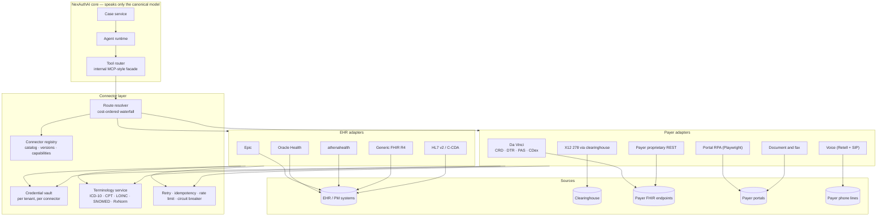
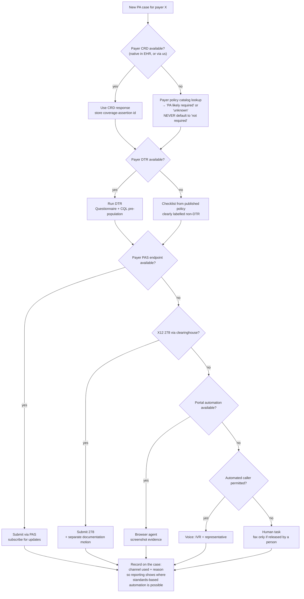
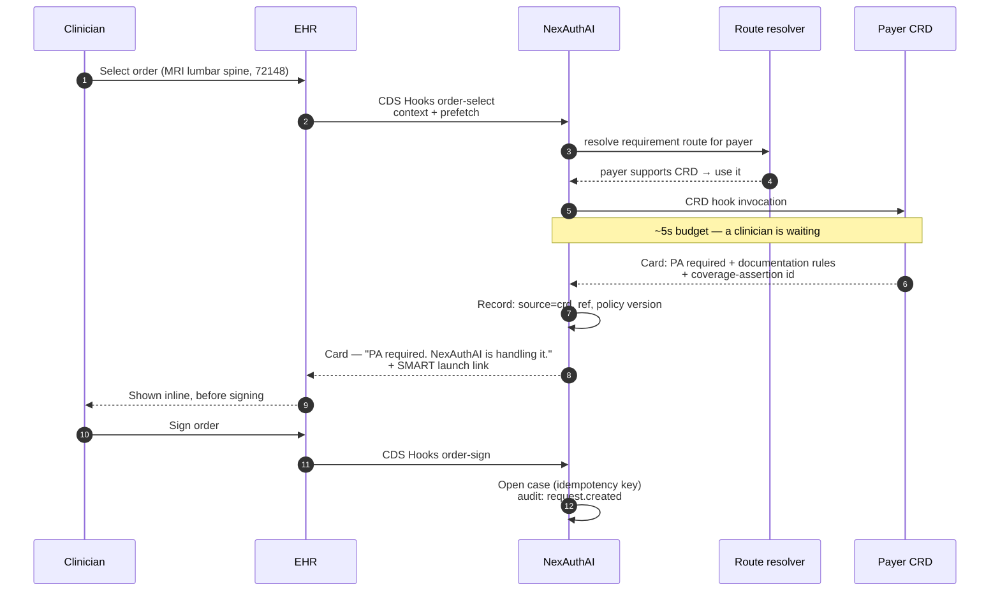
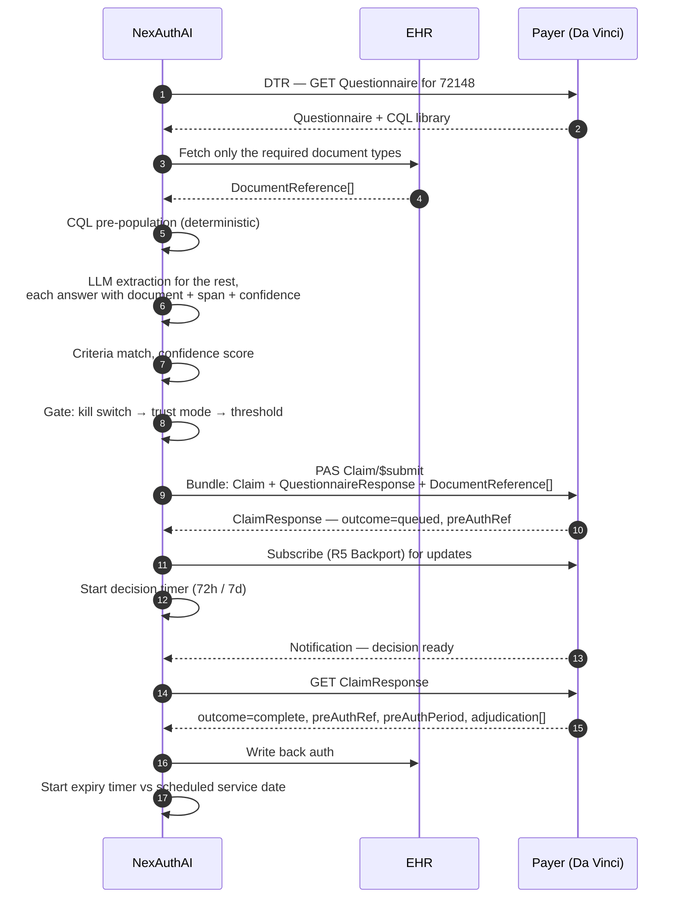

# 05 — Connector Architecture

**One unified, standards-based API that NexAuthAI talks to, with pluggable adapters behind it for every EHR and payer.**

Implemented in the prototype: the contract is [`src/connectors/types.ts`](../src/connectors/types.ts), the adapters are [`src/connectors/mocks.ts`](../src/connectors/mocks.ts), and the routing is [`src/connectors/registry.ts`](../src/connectors/registry.ts). The submission flow genuinely runs through them — the Admin → Connectors screen shows their real state, and testing a connection calls the adapter's own `test()` method.

---

## 1. The problem this layer solves

A mid-size practice deals with dozens of payers. Each one has a different portal, a different form, a different fax number, and — increasingly — a different partial implementation of the same FHIR standard. On the other side, three EHR vendors cover most of the ambulatory market and each exposes a different dialect of the same resources.

Point-to-point integration means *n × m* bridges, every one of which breaks independently. The alternative is a **canonical model in the middle**: adapters translate at the edge, once, and the core never learns a vendor's dialect.

### 1.1 The five layers

The model here follows `medblocks-basics.html` directly, because its vocabulary is exactly right for this problem:

| Layer | Medblocks term | In NexAuthAI |
|---|---|---|
| 1 | **Source** | The system that holds the data — Epic, Availity, Meridian's PAS endpoint, a payer's portal, a phone line |
| 2 | **Connection** | The *authorized link* to one source for one tenant. `ConnectorInstance`, with its own credential and its own state |
| 3 | **Pull** | Fetching — eligibility, requirement, questionnaire, documents, status |
| 4 | **Updates** | Being told what happened — webhooks, FHIR Subscriptions, and connection-state changes |
| 5 | **Data out** | Where records end up — the case, the EHR write-back, the notification, the audit ledger |

The insight worth carrying over is in layer 4. A connection that worked yesterday can quietly stop working today, and nothing in layers 1–3 would tell you. That is why `ConnectorInstance.state` exists as a first-class field — and why the admin screen leads with connection health rather than throughput.

---

## 2. Architecture



---

## 3. The canonical model

Every adapter translates to and from a **FHIR R4–based canonical model**. Full mappings are in `02-data-models.md`; the summary:

| Canonical concept | FHIR R4 |
|---|---|
| Patient, Provider, Organization, Payer | `Patient`, `Practitioner`, `Organization` (US Core) |
| Coverage | `Coverage` |
| The order | `ServiceRequest` / `DeviceRequest` |
| The PA submission | `Claim` (`use = preauthorization`) — Da Vinci PAS |
| The decision | `ClaimResponse` — Da Vinci PAS |
| Documentation questionnaire | `Questionnaire` / `QuestionnaireResponse` — Da Vinci DTR |
| Supporting documents | `DocumentReference` |
| Pend / more information | `Task` — Da Vinci CDex |
| Provenance | `Provenance` on every copied resource |

**Why FHIR R4 rather than something of our own:** every regulatory API and every Da Vinci IG is R4. A proprietary model would add a mapping layer on both sides and buy nothing. R5 is published and R6 is in ballot, but neither is what payers or CMS reference — revisit when EHRs and payers actually move.

---

## 4. The adapter contract

```ts
export interface Connector {
  describe(): ConnectorManifest;
  test(conn: ConnectionRef): Promise<HealthResult>;

  checkEligibility?(conn, req: EligibilityRequest): Promise<ConnectorResult<EligibilityResult>>;
  isPARequired?(conn, req: RequirementRequest): Promise<ConnectorResult<RequirementResult>>;
  getQuestionnaire?(conn, req: QuestionnaireRequest): Promise<ConnectorResult<Questionnaire>>;
  fetchDocuments?(conn, req: DocumentRequest): Promise<ConnectorResult<ClinicalDocument[]>>;
  submitPA?(conn, req: SubmissionRequest): Promise<ConnectorResult<SubmissionReceipt>>;
  getStatus?(conn, externalRef: string): Promise<ConnectorResult<StatusResult>>;
  respondToRFI?(conn, req: RFIResponseRequest): Promise<ConnectorResult<SubmissionReceipt>>;
  writeBack?(conn, req: WriteBackRequest): Promise<ConnectorResult<void>>;
  subscribeToUpdates?(conn, handler: (e: ConnectorEvent) => void): () => void;
}
```

### 4.1 Four decisions in that shape

**Everything except `describe` and `test` is optional.** Capability genuinely varies — most payers in 2026 do not implement CRD, DTR and PAS, and an adapter that had to stub seven methods would lie about what it can do. `ConnectorManifest.capabilities` declares the truth, and the route resolver reads it.

**Every method returns an envelope, not a bare value:**

```ts
interface ConnectorResult<T> {
  ok: boolean;
  data?: T;
  error?: ConnectorFault;
  meta: { connectorId; instanceId; externalRef?; latencyMs; at; via };
}
```

The `meta` block is what gets written to the case ledger. Without it you cannot answer "which system told us that, and when" six months later in a payer dispute — which is the whole point of the audit requirement.

**Errors map to a shared taxonomy**, never the vendor's wording:

`auth_expired` · `rate_limited` · `payer_unavailable` · `validation_failed` · `ui_changed` · `timeout` · `mapping_missing` · `not_supported` · `unknown`

Each carries `retryable: boolean`. The waterfall decides what to do from the taxonomy without knowing which vendor produced it — a new adapter needs no change to the routing logic.

**Idempotency is the adapter's responsibility.** `SubmissionRequest.idempotencyKey` must be honoured: a repeat of the same key is the same submission, not a second one. This, plus inquire-before-submit, is what makes the zero-duplicate acceptance criterion achievable.

---

## 5. EHR connectors

| Connector | Interfaces | Standards | Notes |
|---|---|---|---|
| **Epic** | FHIR R4, SMART backend services, CDS Hooks, Bulk Data | US Core 6.1.0, SMART 2.0, CDS Hooks 2.0.1 | Self-service registration via open.epic. Per-customer scope approval and rate limits still apply. Native CRD is live at several health systems — **design for coexistence, consume their outcome, do not intercept** |
| **Oracle Health (Cerner Millennium)** | FHIR R4, SMART, Bulk Data | US Core, SMART 2.0 | Per-domain enablement. **Write-back support for `Task`, `DocumentReference` and `QuestionnaireResponse` varies by client — confirm, never assume** |
| **athenahealth** | FHIR R4 (4.0.1), SMART v2, proprietary REST | US Core | **athenaOne and athenaPractice are separate connectors** — different identity models (Azure AD B2B/B2C on one side) |
| **Generic FHIR R4** | FHIR R4, SMART | US Core 6.1.0 | Fallback for any US Core–conformant server. ~4 days to onboard |
| **HL7 v2 / C-CDA** | MLLP, SFTP | HL7 v2.5.1 ADT/ORM/ORU, C-CDA R5.0.0 | Legacy fallback where no usable FHIR surface exists |

### 5.1 SMART on FHIR

Two roles, and they are not interchangeable:

**Backend services (system-to-system).** The agent works in the background, not in a user session. `client_credentials` with a signed JWT against a published JWKS, scoped `system/Patient.read system/Coverage.read system/DocumentReference.read system/Task.write`. This is the primary mode.

**EHR launch (user-facing).** A clinician opens the NexAuthAI panel from inside the chart. `launch` + `openid fhirUser` + `patient/*.read`, with the launch context supplying the patient. Used for the order-time experience and clinical review.

### 5.2 CDS Hooks

| Hook | When it fires | What we do |
|---|---|---|
| `order-select` | Clinician picks an order, before signing | Early CRD check — the cheapest possible moment to learn PA is needed |
| `order-sign` | Clinician signs | Authoritative CRD call; open the case |
| `appointment-book` | Appointment booked | Check whether the authorization will still be valid on the date |

Response is a **card**: "Prior authorization required — NexAuthAI is handling it", with a link that SMART-launches the app for anything needing a human. Industry guidance targets a **~5-second** CRD response because a clinician is waiting.

### 5.3 Bulk FHIR

`$export` for population-level sync — refreshing the patient roster, backfilling coverage, warming the terminology cache. Not on the request path; a case never waits on a bulk job.

### 5.4 HL7 v2 fallback

| Message | Use |
|---|---|
| `ADT^A04/A08` | Patient demographics and insurance |
| `ORM^O01` / `OMG^O19` | Orders — the PA trigger |
| `ORU^R01` | Results as evidence |
| C-CDA | Documents |

Higher onboarding cost (~18 days) and no write-back. Worth it only when the alternative is no integration at all.

---

## 6. Payer connectors

### 6.1 Four tiers of payer, descending

| Tier | What they support | Our path |
|---|---|---|
| **1 — Full Da Vinci** | CRD + DTR + PAS + CDex | CRD at order time, DTR questionnaire with CQL pre-population, PAS `Claim/$submit`, CDex for pends. Everything structured |
| **2 — Partial Da Vinci** | CRD + PAS, no DTR/CDex | CRD for the requirement; a **checklist from published policy** instead of a questionnaire; PAS for submission; pends arrive as portal notices |
| **3 — X12 only** | 278 via clearinghouse | 278 inquiry for the requirement, 278 for submission — and **a separate motion for documentation**, because 278 carries no attachments |
| **4 — No API** | Portal and/or fax | Browser automation; voice when the portal cannot resolve it; fax as a human-released last resort |

### 6.2 The capability decision tree



Every branch is recorded. That is how you answer "how much of our volume could actually be automated" with data rather than a guess.

### 6.3 Portal and voice — the honest caveats

**Portal automation** is the highest-maintenance component in the system. Every payer UI change is unplanned work. Mitigations: isolated browser sessions per tenant, screenshot evidence at each step, change detection against a recorded baseline, automatic fallback to the next channel, and alerting on `ui_changed` — which the prototype demonstrates with a deliberately broken Atlas Mutual portal connector.

Also: **check that payer terms permit automated portal access** before building (discovery question DQ-044). A workflow that violates a payer's access terms is a business risk, not just a technical one.

**Voice** carries two checks before every dial:

1. **Automated-caller permission**, per payer, from the requirement matrix. Some payers permit an agent to self-identify as automated; some require a human caller.
2. **Recording consent**, per state — one-party vs two-party, checked for both call origin and termination.

Neither is a default. Both are matrix lookups.

---

## 7. Connector registry and tenant configuration

### 7.1 Two levels

**The registry** is the shared catalog — "Epic", "Availity", "Meridian PAS". One entry per connector type, versioned, with declared capabilities and standards. Built once, reused by every tenant. **This is where the margin is**: a connector built for customer one is nearly free for customer two.

**The instance** is one tenant's configured connection — credentials, environment, state, health. Per tenant, never shared.

### 7.2 Credential vault

Credentials live in a secrets vault (AWS Secrets Manager with KMS envelope encryption). The connector receives a `credentialRef`, never the secret:

```ts
interface ConnectionRef {
  instanceId: string;
  tenantId: string;
  credentialRef: string;   // "vault://northside/epic/prod"
  environment: "sandbox" | "production";
}
```

Scoped per connector, rotated on schedule, never shared across integrations. A compromised payer-portal password does not expose the EHR.

### 7.3 Connection state

| State | Meaning | Action |
|---|---|---|
| `active` | Healthy | Route normally |
| `degraded` | Working, elevated errors or latency | Route, but prefer alternatives and alert |
| `failed` | Not working | Skip in routing; alert |
| `refresh-failed` | Token refresh rejected | **Ask the customer to reconnect** |
| `expired` | Credential lapsed | Rotate |
| `disconnected` | Deliberately removed | Skip |
| `configuring` | Onboarding, not yet validated | Not routable |

The route resolver includes only `active` and `degraded` instances. A failed connection is **skipped rather than attempted** — which is the practical form of "act on connection state, not on whether an OAuth flow once finished".

---

## 8. Terminology services

Translation happens at the adapter boundary. The core only ever sees standard codes.

| From | To | When |
|---|---|---|
| Epic EAP / athenaOne order type / local order code | **CPT / HCPCS** | Every order. Payer rules are keyed on billing codes |
| SNOMED CT | **ICD-10-CM** | Problem lists are SNOMED-coded; PA requests need ICD-10 |
| Local document type | **LOINC** | `DocumentReference.type` is often unpopulated |
| Local payer ID | **X12 payer ID** | EDI routing |
| Local drug ID | **RxNorm** | And normalise term type — SCD vs SBD |

Each translation records `codeSystemFrom`, `codeSystemTo` and the `ConceptMap` version applied, so an unexpected denial is diagnosable from the case rather than from a log file. Unmapped codes surface on the admin field-mapping viewer as `unmapped` or `needs-review` — the prototype shows 14 unmapped Oracle Health order codes blocking that connector's go-live, which is exactly the kind of thing that silently delays an integration.

---

## 9. Reliability

| Concern | Approach |
|---|---|
| **Retries** | Exponential backoff with jitter, only for `retryable` faults. Never retry `validation_failed` — it will fail identically |
| **Idempotency** | Every write carries the case's idempotency key. Adapters must treat a repeat as the same operation |
| **Rate limiting** | Per-connection token bucket, tuned to each vendor's published limits. Degrade to queueing, not failing |
| **Circuit breaker** | Open after *n* consecutive failures; the resolver skips the route while open; half-open probe on a timer |
| **Timeouts** | Per operation — CRD ~5s (a clinician is waiting), PAS ~30s, portal ~2min, voice ~15min including hold |
| **Checkpoints** | Long-running pulls record progress so a restart resumes rather than restarting |
| **Outbox** | State change and outbound event commit in one transaction. No lost or phantom events |

### 9.1 Webhooks and subscriptions

| Mechanism | Where |
|---|---|
| **FHIR Subscriptions (R5 Backport 1.1.0)** | Da Vinci PAS pended-response notifications |
| Vendor webhooks | Payer proprietary APIs, clearinghouse status |
| Polling | Everything else — scheduled by SLA deadline, not on a fixed interval |

Inbound webhooks are **signature-verified, deduplicated by event id, and processed through an inbox table** so a redelivery cannot double-apply.

The four event types that matter map directly onto the Medblocks Updates layer:

| Event | Meaning |
|---|---|
| `records.sync.completed` | A background pull finished; new data is ready |
| `records.sync.failed` | A pull failed; alert someone |
| `status.changed` / `info.requested` / `decision.received` | The payer moved the case |
| **`connection.token_refresh_failed`** | **Access lapsed — ask the customer to reconnect.** The one that justifies the whole layer |

---

## 10. Sequence diagrams

### 10.1 PA-required check at order time (CRD)



**If the payer has no CRD:** the resolver falls to a 278 inquiry, then the versioned payer matrix. If none answers, the result is **`unknown`** — and the case routes to a human. It is never turned into "not required".

### 10.2 Full submission via PAS



### 10.3 X12 278 via clearinghouse

```mermaid
sequenceDiagram
  autonumber
  participant N as NexAuthAI
  participant C as Clearinghouse
  participant P as Payer

  N->>C: 270 eligibility inquiry
  C->>P: 270
  P-->>C: 271 — active, plan, member
  C-->>N: 271 (+ trace number)

  N->>C: 278 inquiry — is PA required for 72148?
  C->>P: 278
  P-->>C: 278 response
  C-->>N: required (+ TRN trace)

  N->>C: 278 request<br/>2010A/C/E loops, UM, HI, SV1
  C->>P: 278
  P-->>C: 278 response — HCR01=A4 (pended)
  C-->>N: pended + REF02 reference

  Note over N,P: 278 carries NO attachments.<br/>Documentation needs a separate motion.

  N->>N: Resolve documentation channel from the payer matrix
  alt payer accepts portal upload
    N->>P: Portal upload against the existing case
  else payer accepts fax
    N->>N: Queue for human release — never auto-faxed
  end

  loop until decided
    N->>C: 278 inquiry (scheduled by SLA deadline)
    C-->>N: HCR01 = A1 / A3 / A6
  end
  N->>N: Map HCR01 → Decision outcome; store REF02 as auth number
```

### 10.4 Pended → RFI → resubmission

```mermaid
sequenceDiagram
  autonumber
  participant P as Payer
  participant N as NexAuthAI
  participant E as EHR
  participant S as Staff

  P->>N: ClaimResponse outcome=queued<br/>+ CDex Task: "need PT discharge summary"
  N->>N: Case → pended. Record the reason + reference
  N->>N: Raise task: rfi-response (resolvable by agent)
  N-->>S: Notify — IDs only, no clinical detail

  S->>N: Release
  N->>E: Fetch THAT ONE document
  E-->>N: DocumentReference
  N->>N: Compliance check — is this within the payer's ask?

  N->>P: Fulfil CDex Task<br/>(NOT a new Claim/$submit)
  Note over N,P: No new submission.<br/>No new authorization.<br/>Review resumes where it paused.
  P-->>N: Task accepted; review resumed
  N->>N: Case → in-review. Recheck scheduled

  alt the gap is clinical, not administrative
    N->>N: Route to clinical review instead
    Note over N: The agent never decides<br/>whether evidence that does not exist<br/>should be created
  end

  P-->>N: ClaimResponse — approved
  N->>E: Write back
```

---

## 11. Onboarding playbook

### 11.1 Target times

| Scenario | Target | Basis |
|---|---|---|
| Payer already in the registry, tenant has credentials | **< 1 day** | Configuration only |
| New payer, Da Vinci (tier 1–2) | **5–9 days** | Registration, conformance, pilot |
| New payer, X12 only (tier 3) | **6 days** | Clearinghouse trading-partner setup |
| New payer, portal only (tier 4) | **5 days** build, then ongoing maintenance | Recording and hardening the flow |
| New EHR, generic FHIR | **4 days** | US Core conformant |
| New EHR, named vendor | **10–15 days** | Vendor program + per-customer activation |
| New EHR, HL7 v2 only | **18 days** | Interface engine work |

> ⚠️ **These are targets with a stated basis, not measured results.** The source folder asserts "auto-provisioned in minutes" for a registry match and prices 3 hours per electronic route and 4 per portal — neither figure has evidence behind it. Measure the first three real onboardings and replace this table.
>
> And the number that actually moves is not engineering. **Vendor program enrollment and per-customer activation are gated by other organisations' calendars.** A 10-day Epic connector can sit for six weeks waiting on a customer's security review.

### 11.2 Adding a payer

| Step | What | Who | Days |
|---|---|---|---|
| 1 | **Discovery** — endpoints, supported IG versions, product lines covered, test environment, trust model, automated-caller policy, portal terms | Integration lead | 1–2 |
| 2 | **Legal** — API terms; our status as the provider's business associate; any payer-specific agreement | Compliance | parallel |
| 3 | **Registration** — client registration, public keys for backend services (required for DTR) | Integration eng | 1 |
| 4 | **Capability declaration** — write the manifest; declare only what is real | Integration eng | 0.5 |
| 5 | **Adapter** — implement the contract; map errors to the taxonomy | Integration eng | 1–3 |
| 6 | **Terminology** — ConceptMaps for this payer's code expectations | Integration eng | 0.5 |
| 7 | **Conformance** — Inferno test kits for CRD/DTR/PAS client roles; payer-specific scripts | QA | 1 |
| 8 | **Contract tests** — recorded fixtures, error taxonomy, idempotency | QA | 0.5 |
| 9 | **Pilot** — limited services, sites and volumes; compare against portal outcomes | Integration lead | 2–5 |
| 10 | **Registry entry + Shadow** | Platform admin | 0.5 |
| 11 | **Production** — monitoring, SLOs, escalation contacts, change notification | DevOps | 0.5 |

### 11.3 Adding an EHR

**Two gates, and plans that budget only the first one slip.**

**Gate 1 — vendor program:** app registration, sandbox access, published JWKS, any certification or marketplace review.

**Gate 2 — per-customer activation:** the provider organisation approves the app, approves scopes, supplies environment URLs, provisions users, and completes their own security questionnaire. **This gate is not under your control.**

| Step | What | Days |
|---|---|---|
| 1 | Vendor enrollment, app registration, sandbox | 2–5 |
| 2 | **Customer-side:** security questionnaire, BAA, app approval, scope approval | **gated by them** |
| 3 | Connectivity test in the customer's non-production environment with their test patients | 1 |
| 4 | **Data-quality assessment** — coded coverage, order codes, problem-list coding rates | 1–2 |
| 5 | Field mapping + ConceptMaps for their local codes | 1–3 |
| 6 | Write-back confirmation — which resources this site actually permits | 0.5 |
| 7 | Go-live runbook: rollback, support contacts, dashboards, change-freeze windows | 0.5 |

Step 4 is the one teams skip and regret. If a site's problem lists are 40% uncoded, DTR pre-population will not work there, and you want to know that before you promise a touchless rate.

### 11.4 Adapter checklist

- [ ] `describe()` declares only genuinely implemented capabilities
- [ ] `test()` exercises credentials and a real endpoint, not a ping
- [ ] Every method returns `ConnectorResult` with complete `meta`
- [ ] Native errors mapped to the shared taxonomy with correct `retryable`
- [ ] `submitPA` honours `idempotencyKey`
- [ ] No PHI in logs, traces or error messages
- [ ] Credentials read from the vault by reference; never logged
- [ ] Timeouts set per operation
- [ ] Rate limits match the vendor's published limits
- [ ] Contract tests against recorded fixtures
- [ ] Terminology mappings registered, with unmapped codes surfaced
- [ ] Registry entry: version, capabilities, standards, onboarding estimate
- [ ] Runbook: what breaks, how it is detected, what to do

---

## 12. Mock connectors in the prototype

These implement the real contract and are wired into the real routing — the Admin → Connectors screen and the submission flow both go through them.

| Mock | Demonstrates |
|---|---|
| `MockEpicConnector` | Full EHR: eligibility cross-check, CRD via CDS Hooks, minimum-necessary document fetch, write-back, subscriptions |
| `MockCernerConnector` | **Partial capability.** Fails `fetchDocuments` with `mapping_missing` (14 unmapped local order codes) and `writeBack` with `not_supported` (Task not enabled for the domain) |
| `MockAthenaConnector` | **A lapsed connection.** Returns `auth_expired` — the Medblocks layer-4 case, visible as `refresh-failed` on the admin screen |
| `MockGenericFhirConnector` | The US Core fallback |
| `MockMeridianPASConnector` | **Tier 1.** CRD + DTR + PAS + CDex. Also returns an evidenced `paRequired: false` for physical therapy codes |
| `MockGranitePASConnector` | **Tier 2.** CRD + PAS at IG 2.0.1, and `not_supported` on `getQuestionnaire` because it has no DTR |
| `MockX12ClearinghouseConnector` | **Tier 3.** 270/271 and 278, with the no-attachments note. Returns terminated coverage for one member and `validation_failed` on a payer-specific member-ID format |
| `MockPortalRpaConnector` | **Tier 4.** Instantiated per payer; the Atlas Mutual instance is deliberately broken with `ui_changed` so the waterfall visibly falls through to voice |
| `MockVoiceConnector` | Realistic call duration including hold; returns a representative-issued reference number |

Latency is simulated throughout — electronic responses in hundreds of milliseconds, portal in tens of seconds, voice in minutes — so the cost ordering of the waterfall is something you *feel* in the prototype rather than something the documentation asserts.

---

*Next: `NexAuthAI-Solution.md`.*
