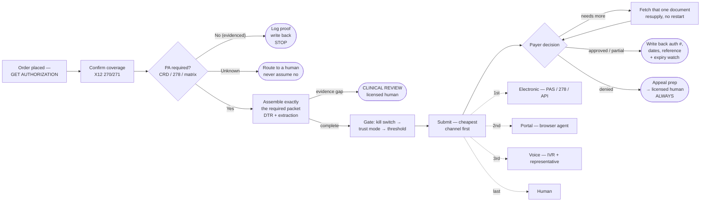
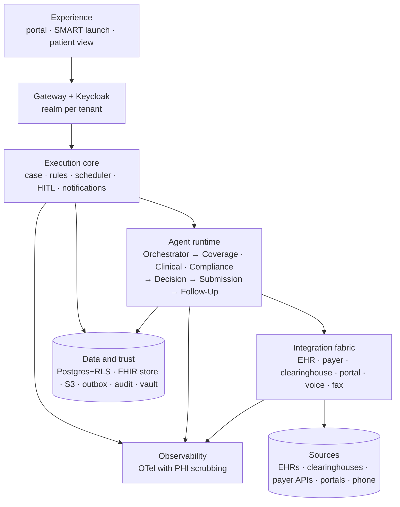

# NexAuthAI — Solution Document

**AI-assisted prior authorization: what we are building, why, how, and what remains unanswered.**

| | |
|---|---|
| Version | 1.0 — 1 October 2026 |
| Status | **Proposal for review.** Nothing here is implemented in production or certified |
| Prototype | Frontend-only, synthetic data. `npm install && npm run dev` |
| Built from | `medblock-pr-auth-study/prior-authorization/` — full source audit in [`00-source-analysis.md`](00-source-analysis.md) |
| Companion docs | [Personas & journeys](01-personas-and-journeys.md) · [Data models](02-data-models.md) · [Architecture](03-architecture.md) · [Build plan](04-build-plan.md) · [Connectors](05-connector-architecture.md) |

---

## 1. Executive summary

Prior authorization is the single most repetitive, phone-heavy administrative burden in a physician practice. CAQH data puts US medical PA volume at **272 million transactions a year**, of which **177 million are not fully electronic**. A physician's practice spends 12–14 hours a week per physician on it, and 40% of practices hire staff exclusively to do it.

**NexAuthAI makes the doctor's part one button.** The physician clicks *Get Authorization*. The agent confirms coverage, asks the payer electronically whether authorization is even required, assembles exactly the clinical packet that payer's policy asks for, submits it the cheapest way that payer supports, handles the mid-review document demands, and writes the result back into the chart. Staff see only the exceptions — each one already loaded with the context behind it.

**The line it never crosses: the agent does the paperwork; it never makes the medical judgment.** Medical necessity, peer-to-peer and every denial go to a licensed human. In this design that is not a policy statement — it is enforced in code, and there is no path that records a denial without a named licensed reviewer.

**Three things make this buildable now rather than speculative.** First, CMS-0057-F obliges impacted payers to expose FHIR prior-authorization APIs by **1 January 2027**, so building on Da Vinci CRD/DTR/PAS means compliance and the automation roadmap are the same project. Second, the hard part is not the model — it is the connectivity graph, and a pluggable adapter layer makes each new payer cheaper than the last. Third, the failure modes are already documented: Olive AI's $850M collapse, the n8n PHI incident, and UnitedHealth's nH Predict litigation each name a specific thing not to do.

**What we are asking for.** A 26-week build to one practice in production, starting with one payer and one high-volume imaging CPT family, in Shadow mode. Peak team ~11 FTE. **Ten decisions in §13 need owners before Phase 1 begins**, and 107 discovery questions are currently unanswered.

---

## 2. Problem statement

### 2.1 The work, as it is done today

```
Physician orders a lumbar MRI
        ↓
Authorization coordinator picks it up
        ↓
Logs into the EHR → finds the insurance
        ↓
Logs into a payer portal → is PA even required for 72148?
        ↓
Logs into another system → pulls office notes, therapy notes, imaging history
        ↓
Re-types everything into the payer's form
        ↓
Uploads the packet, or faxes it
        ↓
Waits. Calls. Waits on hold. Calls again.
        ↓
"We need the physical therapy discharge summary."
        ↓
Back to the EHR. Find it. Upload it. Wait again.
        ↓
Approved — or denied, and now someone has to appeal
```

Twenty to forty minutes of a trained person's time, per authorization, mostly spent moving data between systems that already have it.

### 2.2 What the source material identifies

| Pain point | Source |
|---|---|
| Staff log into a dozen payer portals and re-type data the EHR already holds | Client requirements |
| Missing documentation is discovered **after** submission, not before | Client requirements; competitor delay taxonomy |
| Every payer has different rules, and those rules live in people's heads | Vision & Scope §9 |
| Approvals lapse before the procedure date | Vision & Scope §3C |
| Follow-up is phone calls and hold music | Client requirements |
| Denials need a clinician, but reaching one is ad hoc | Vision & Scope §4 |
| No audit trail when a payer disputes what was said on a call | Vision & Scope §5 |

The competitor delay taxonomy in the folder names the top five causes: **missing or incomplete clinical documentation; incorrect or missing CPT/ICD codes; authorization requirement not verified; payer-specific requirements not reviewed; inconsistent intake process across staff.** Four of those five are addressable by doing the check earlier and the assembly automatically. The fifth — inconsistency across staff — is addressable by removing the step.

### 2.3 Sizing

| Figure | Value | Credibility |
|---|---|---|
| US medical PA volume | **272M/yr** (95M electronic, 123M partial, 54M manual) | **CAQH 2024** — strongest figure available |
| Provider cost per transaction | **$5.38 / $8.93 / $12.88** by mode | CAQH 2024 |
| Core automation pool | 177M non-fully-electronic transactions | Derived |
| PAs per physician | 39–43/week ≈ 160–175/month | AMA surveys, **via a screenshot** — medium |
| Staff time | 12–14 hrs/week per physician | Same — medium |
| Practices hiring dedicated PA staff | 40% | Same — medium |
| Manual cost per PA | $20–30 | Same — **and it contradicts CAQH's $12.88** |
| System-wide cost reduction | **Not demonstrated** | **PHTI 2026 — independent** |

**⚠️ Two honesty notes that belong in any client conversation.**

The folder's business case runs on **$20–30 per manual PA**, from a search-result screenshot. Its own pricing workbook cites CAQH at **$12.88**. The "~5-day onboarding payback" claim is built on the higher figure. Re-derive anything client-facing on CAQH, or state the basis.

And the one independent study in the entire source library — the Peterson Health Technology Institute's 2026 report — found that AI PA tools reduce manual effort *within* an organisation but have **not** been shown to lower system-wide cost, partly because faster provider submission triggers more payer-side scrutiny. The win is real: faster care, less burnout, better documentation. Don't oversell the cost case.

---

## 3. One portal, three personas

Full detail in [`01-personas-and-journeys.md`](01-personas-and-journeys.md).

### 3.0 One portal

**There is exactly one application.** Every tenant on the platform and every persona inside it signs into the same portal at the same address — no separate build per customer, no separate app per role, no separate operator console. A Keycloak token carries two things, and between them they decide everything:

| The token carries | It decides | Enforced by |
|---|---|---|
| `tenant_id` (realm-bound) | **Whose** data you see | One realm per tenant · `tenant_id` first in every key and index · PostgreSQL row-level security |
| Scopes | **What** you may do with it | API scope check per endpoint · re-checked in the service layer · UI renders from the same scopes |

Multi-tenancy and multi-persona are the same mechanism seen from two angles. A customer that requires its own infrastructure gets a dedicated or air-gapped deployment of this same codebase, with its own realm and keys — a deployment option, not a different product. One person may hold more than one persona, and the portal renders the union of their scopes.

The prototype says this on the sign-in screen, in the header (a tenant chip beside a persona chip) and on `/portal`, which sits in every persona's navigation.

### 3.1 The three personas

Reduced to the three the client's own persona table names, with **Tenant Admin and Master Admin merged into one `admin` persona with two reaches**.

| Persona | Who | Sees / does | Clinical authority |
|---|---|---|---|
| **Staff / Operations** | The practice's queue workers — billing and front desk combined | Status, submissions, document follow-up, administrative exceptions; places the authorization request; releases held submissions | None |
| **Clinical Reviewer** *(licensed)* | A licensed clinician | Medical-necessity gaps, denials, appeals, peer-to-peer — kept a **distinct persona on purpose** so only licensed people make, and are audited for, medical calls | **Attests evidence, approves appeals, attends peer-to-peer** |
| **Admin** | The practice's own admin (**tenant reach**) or the platform operator (**platform reach**) | Tenants, users and roles, rules and thresholds, payer matrix, connections, billing, audit log | None, and **no PHI scope at all** |

**Why the two admins are one persona.** The Vision & Scope's distinction between Tenant Admin and Master Admin is real, but it is a matter of *scope*, not of screens: a tenant admin manages one practice, a platform admin manages every tenant plus the shared connector registry, and both use the same console in the same portal. `User.adminScope` is the only thing that differs. Neither can open a case — a platform admin can see that a tenant's exception rate is climbing and cannot see a single case behind it.

**What has no seat here.** There is no ordering-physician persona: the physician's one action, *GET AUTHORIZATION*, is placed by Operations or arrives from the EHR as `order-sign`, and anything clinical routes to the Clinical Reviewer. There is no payer persona: payers are counterparties reached through connectors, not tenants of this platform. There is no patient persona: patient access to PA status is a CMS-0057-F obligation from 1 January 2027, served through the practice and consent-gated, not a login here.

> Earlier drafts of this document modelled payer intake and payer clinical reviewers and a patient portal. Those were an inference (gap **G1**), not a client requirement, and they are out — see §13.2. The rule they encoded has not gone anywhere: **no determination originates in this portal.** Approve, deny and partially approve arrive from the payer through a connector and are recorded as the payer's act, and every denial unconditionally raises a task for the licensed Clinical Reviewer.

### 3.2 Multi-tenancy

Four tenants ship in the prototype — three multi-tenant, one on a dedicated deployment — isolated by three independent mechanisms, none of which is a second portal:

1. **Realm.** One Keycloak realm per tenant. A token issued by one realm is not accepted by another, so cross-tenant access fails before any application code runs.
2. **Scope.** The API checks the scope the endpoint requires. A missing scope is a 403, whichever tenant you belong to.
3. **Row-level security.** Postgres filters by `tenant_id` taken from the token — never from the URL — so a query that forgets its tenant returns nothing rather than someone else's rows.

See §9.2 for the full isolation stack.

### 3.3 Notifications — email and web push

The domain events that move a case fan out to a notification service on three channels. **In-app** is the queue itself and is always on. **Email** (transactional) and **web push** (browser service worker) are what leave the building, and each is opt-out per event type, per user.

One payload rule, identical on all three: a notification carries an ID and an event type and **nothing else** — no patient name, no diagnosis, no procedure code, no payer rationale. The message says a case needs attention and links back into the app, where access is re-checked on arrival. An inbox and a lock screen are the two places PHI must never sit.

Turning a channel off suppresses *delivery* only: the event still fires, the in-app row still appears, and the audit entry is still written. Events are role-scoped — a clinical-review request only reaches the Clinical Reviewer, a held submission only reaches Operations, a connection failure or an invoice only reaches Admin.

### 3.4 Billing and payment

One Stripe customer per tenant. A **subscription, not a price per authorization**:

| Component | Type | Shape |
|---|---|---|
| Onboarding | One-time | Tiered by complexity — ~$3.5K (Starter) to ~$20K (Enterprise+) |
| Annual license | Recurring | Tiered by physician count — ~$15K/yr to ~$175K/yr; per-physician rate falls with scale |
| Managed services + cloud | Recurring, **flat** | ~$3,000 per customer per month |
| Net-new integration | One-time, hourly | $50/hr; once a connector is reusable, later customers do not re-pay its build |
| Pass-through usage | Recurring, variable | EDI transactions, portal sessions, voice minutes, model tokens, fax pages — itemised per channel or folded into the flat fee, per tenant |

The **$4-per-PA** figure in the market model is a TAM/SAM sizing device, never the billing mechanism.

Every usage record names the case that caused the spend, so an invoice line — *"612 voice minutes"* — audits down to the exact cases behind it. That prices the waterfall honestly: an electronic check costs a fraction of a cent, a portal session cents, a voice call dollars, which makes cheapest-channel-first a margin decision as well as a speed one. Stripe holds the payment instrument; the portal reads back a brand, a last four and a `pm_…` reference, and settling an invoice writes `invoice.paid` to the audit log like any other act.

### 3.5 The ten journeys

| # | Journey | Ends as |
|---|---|---|
| J1 | Happy path, electronic | Approved, no human touched it |
| J2 | **No authorization required** — evidenced, with source and reference | Closed, written back to the chart |
| J3 | Clinical gap → licensed clinician attests | Submitted |
| J4 | Held by the automation gate → Operations release | Submitted |
| J5 | Portal fails → voice succeeds | Submitted, with transcript |
| J6 | Pended → one document resupplied, **without restarting** | Approved |
| J7 | Denial → licensed human approves the appeal | Appeal filed |
| J8 | Approval expires before the service date → extension | Approved (extended) |
| J9 | Coverage terminated → corrected → re-run | Continues |
| J10 | Duplicate order → **blocked** | Existing case opened |

All ten are clickable in the prototype. The README's demo script walks J1, J3 and J7, then the admin side.

---

## 4. The solution

### 4.1 What it does



### 4.2 Key features

| Feature | What it means in practice |
|---|---|
| **One-click authorization** | One action — from the EHR at order-sign, or from Operations |
| **Cost-ordered waterfall** | Electronic → portal → voice → human, on every case. Failed attempts stay on the record |
| **Evidenced "not required"** | A "no" is recorded with source, date and reference number. Never a silent default |
| **Minimum-necessary packet** | Only what the matched rule asks for leaves the chart |
| **DTR auto-fill** | Structured fields deterministically; extraction for the rest, each answer with document and span |
| **Explainable confidence** | Six named weighted components, not a bare number |
| **The automation gate** | Kill switch → trust mode → threshold, in that order. The audit says which one held it |
| **Trust ramp** | Shadow → Supervised → Wider, per payer, per workflow, by written sign-off |
| **Pended loop** | One document resupplied without creating a second authorization |
| **Expiry watch** | Flags an approval that lapses before the booked procedure date |
| **Appeals with a human gate** | The agent drafts; a licensed clinician approves filing |
| **Write-once audit** | Hash-chained; every action has an actor, timestamp and reference |
| **Connector layer** | A new payer is a new adapter, never a change to the engine |
| **Exceptions-only queue** | If a case is not on your list, the agent is still working it |

### 4.3 In and out of the first release

| In | Out (later) |
|---|---|
| One EHR connector, read + write-back | Every major EHR; HL7 v2 interface engine |
| One clearinghouse lane (270/271, 278) | National HIE, TEFCA |
| Da Vinci CRD/DTR/PAS where the pilot payer is live | Full Da Vinci across all payers |
| One high-volume imaging CPT family | Every specialty |
| 1–2 portal workers, one voice flow | Full portal catalog, many IVR maps |
| Pended/RFI loop, timers, expiry watch | Pharmacy ePA (NCPDP SCRIPT) |
| Exception queue, clinical queue, case detail, patient journey | Visual workflow designer |
| Admin: users, rules, payer matrix, connections, audit | Self-serve onboarding marketplace |
| Email + web push (no PHI) | SMS |
| Single tenant in production, multi-tenant-ready schema | Dedicated / air-gapped tooling |

---

## 5. AI capabilities and guardrails

### 5.1 What the AI does

| Capability | How |
|---|---|
| **Document extraction** | Deterministic (CQL/FHIRPath) first; LLM with JSON-Schema-constrained output for narrative text. Every fact carries document, span and confidence |
| **Criteria matching** | Per criterion: `met` / `not-met` / `unclear`, with evidence and confidence. The **rules engine** decides what that means for routing |
| **Missing-documentation detection** | Against the matched rule's required list, flagged as agent-resolvable, staff-resolvable or clinician-resolvable |
| **Letter drafting** | A medical-necessity letter citing only extracted facts, never sent without human approval |
| **Confidence scoring** | Six weighted components, all stored and displayed |
| **Transcript structuring** | Converting a payer call into a structured outcome with a reference number |

### 5.2 What the AI never does

- **Never issues a denial.** `AIRecommendation` has three values — submit, gather more, escalate. There is no fourth.
- **Never decides medical necessity.** It reports facts and gaps.
- **Never files an appeal alone.** A licensed clinician approves.
- **Never calls a payer that forbids automated callers**, and never records without checking state consent.
- **Never recalls a payer rule from model memory.** Rules come from the versioned engine.

### 5.3 The guardrails, and where they come from

| Guardrail | Enforced how | Why |
|---|---|---|
| No AI denial | Type system + service-layer throw | nH Predict: denial rate roughly doubled, ~90% alleged appeal reversal, class action |
| Named licensed reviewer for any denial | `recordDecision` rejects without one | Vision & Scope §4, §8 |
| Minimum necessary | Document fetch filtered by rule | PA is a HIPAA *payment* disclosure — treatment exception does not apply |
| No duplicate authorization | Idempotency key + inquire-before-submit | Acceptance criterion is **zero** |
| No PHI in notifications | No field exists to put it in | Vision & Scope; end-to-end flow |
| Tenant isolation | Realm + API + RLS + storage prefix | Four layers, because one is a bug away from being none |
| Deterministic first | No model call where a FHIR field answers | Cost, latency, auditability |
| Versioned prompts and models | Stored per case | Reproducibility |
| Kill switch | Tenant Admin, audited | Operational safety |
| No consumer tools on the PHI path | Architecture rule | The n8n case |

### 5.4 Human-in-the-loop

Three checks, fixed order: **kill switch → payer trust mode → confidence threshold.** Any one holds the case, and the audit entry names which. A held case is not a blank form — the human sees the agent's findings pre-populated, so they correct rather than start over.

### 5.5 Monitoring

Extraction accuracy per field; requirement-check accuracy; **confidence calibration per payer** (predicted vs actual); duplicate rate (must be zero); human override rate by payer and criterion; denial rate against baseline. Workflow replay re-runs historical cases through any new rule, prompt or model version before promotion.

---

## 6. Data models

24 entities, FHIR R4–based. Full detail in [`02-data-models.md`](02-data-models.md); interfaces in [`src/types/`](../src/types/).

The organising idea: **one canonical Case.** API, portal, voice and human are attempts on it. The case id does not change when the waterfall falls through — only `attempts[]` grows. That single decision is what makes the audit trail, the patient journey and the KPI roll-ups work without reconciliation.

**Core mappings:**

| Concept | FHIR R4 | X12 278 |
|---|---|---|
| PA submission | `Claim` (`use = preauthorization`) — PAS | 2000E/F loops, UM/HI/SV1 |
| Decision | `ClaimResponse` — PAS | `HCR01` (A1/A3/A4/A6) |
| Authorization number | `preAuthRef` | `REF02` (BB) |
| Validity period | `preAuthPeriod` | `DTP03` (007) |
| Questionnaire | `Questionnaire` / `QuestionnaireResponse` — DTR | — |
| Pend / more info | `Task` — CDex | `HCR01 = A4` |
| Eligibility | `Coverage` | 270 / 271 |

**One thing worth knowing early: X12 278 carries no attachments.** Any plan assuming it transports a clinical packet is wrong; documentation needs a separate motion on that lane. The 275/277 attachments compliance date is 26 May 2028, and PA attachments are not finalised.

---

## 7. Architecture

Full detail in [`03-architecture.md`](03-architecture.md).



**Stack:** TypeScript end to end — React 19 portal, Node 22 modular monolith, PostgreSQL 16 with row-level security running a durable state machine with an outbox. Background workers for connectors, Playwright for portals, Retell for voice. Keycloak for identity (realm per tenant), HAPI or Medplum for the FHIR store, Stripe for billing. AWS under BAAs, HIPAA-eligible services only.

**Seven design rules:** canonical case / many channels · core closed, connectors open · LLMs reason, rules decide · durable by default · two storage layers linked by provenance · connections are stateful · modular monolith first.

---

## 8. Integration and connector strategy

Full detail in [`05-connector-architecture.md`](05-connector-architecture.md).

**One contract, many adapters.** NexAuthAI's core talks to a single `Connector` interface — `checkEligibility`, `isPARequired`, `getQuestionnaire`, `fetchDocuments`, `submitPA`, `getStatus`, `respondToRFI`, `writeBack`, `subscribeToUpdates`. Behind it sits a pluggable adapter per EHR and per payer.

Shaped on the Medblocks five layers: **Source** (the system) → **Connection** (the authorized, per-tenant link) → **Pull** (fetching) → **Updates** (webhooks, and connection-state changes) → **Data out** (the case, the write-back, the audit).

**Payers come in four descending tiers,** and the design assumes the lower ones persist:

| Tier | Support | Path |
|---|---|---|
| 1 | Full Da Vinci | CRD → DTR → PAS → CDex |
| 2 | CRD + PAS, no DTR | CRD, policy checklist, PAS, portal pends |
| 3 | X12 only | 278 + separate documentation motion |
| 4 | Portal / fax only | Browser automation → voice → human |

Every branch is recorded on the case, so "how much of our volume could actually be automated" is answerable with data.

**EHRs:** Epic, Oracle Health, athenahealth, generic FHIR R4, HL7 v2 fallback. SMART backend services for the agent; SMART EHR launch for clinician-facing moments; CDS Hooks `order-select` / `order-sign` to fire CRD at the point of ordering; Bulk FHIR for population sync.

**Onboarding targets:** <1 day for a registry match; 5–9 days for a new Da Vinci payer; 10–15 for a named EHR. ⚠️ **These are targets with a stated basis, not measured results** — and the number that actually moves is vendor enrollment and per-customer activation, which are gated by other organisations' calendars.

---

## 9. Security, privacy and compliance

### 9.1 HIPAA

NexAuthAI operates as a **business associate** of each provider organisation.

| Control | Implementation |
|---|---|
| BAAs | Every subprocessor touching PHI — hosting, voice, model API — **before** PHI enters |
| Encryption | At rest (KMS, customer-managed keys for dedicated tier) and in transit (TLS 1.2+) |
| Minimum necessary | Only payer-required documents leave the chart |
| Audit | Append-only, hash-chained, with actor, action, target, reference. Retention commonly 6 years — **confirm with counsel** |
| Access | MFA before any PHI; short-lived tokens; SMART scopes |
| No PHI in | Notifications, logs, traces, metrics. Scrubbed at the OTel collector |
| Data ownership | The practice's. Exportable. **Never used to train a cross-tenant model without explicit opt-in** |
| Call handling | Automated-caller permission per payer; one- vs two-party recording consent per state, checked per call |

### 9.2 Tenant isolation — four layers

Keycloak realm per tenant → `tenant_id` from the token (never the URL) → PostgreSQL RLS → per-tenant storage prefixes and KMS keys. Cross-tenant reads must fail at **both** the API and the database in automated tests.

All four layers sit inside **one application**. Isolation is never achieved by giving a customer a different portal — a dedicated or air-gapped tenant runs the same codebase in its own VPC with its own realm and keys, which changes where it runs and not what it is. An admin with platform reach spans tenants for configuration and health only: the persona holds no PHI scope, so there is no path by which cross-tenant oversight becomes cross-tenant data access.

### 9.3 RBAC and ABAC

Roles map to scopes; attributes handle what roles cannot express — a physician sees their own orders, a payer user sees only their payer's submissions, a patient sees only their own record, and each agent role gets only the tools and fields it needs. The platform-operator role has **no PHI scopes at all**.

### 9.4 Regulatory

**CMS-0057-F** requires impacted payers (Medicare Advantage, Medicaid/CHIP, QHPs on the FFEs) to expose four FHIR APIs by **1 January 2027**, with a Prior Authorization API built on Da Vinci PAS. Decision timeframes of **72 hours expedited / 7 calendar days standard** have applied since 1 January 2026. Commercial employer plans are **not** impacted.

⚠️ **Verify before relying on any of it.** The research underlying this was current as of 30 September 2026. Re-check: the 2027 deadline and any enforcement discretion; the timeframes' scope; CMS-0062-P (proposed, not final); Da Vinci IG versions per payer; X12 275/277 (26 May 2028); NCPDP SCRIPT 2023011 (1 Jan 2028); the WISeR model; and state law on gold-carding, turnaround and call-recording consent.

### 9.5 SOC 2

Target **Type I before external market launch, Type II after.** Change management, quarterly access reviews, vendor management with BAAs, monitoring and alerting, vulnerability management with an annual pen test, and a BC/DR plan that has actually been tested.

---

## 10. Build plan, team, timeline, cost

Full detail in [`04-build-plan.md`](04-build-plan.md).

| Phase | Weeks | Exit |
|---|---|---|
| 0 · Discovery | 0–2 | Scope signed, baseline measured, **enrollment started** |
| 1 · Core | 1–3 | Synthetic case end to end |
| 2 · Electronic lane | 4–6 | Real sandbox case with a traceable reference |
| 3 · Fallbacks + hardening | 7–9 | Full waterfall as one workflow |
| 4 · Shadow pilot | 10–13 | Acceptance thresholds met |
| 5 · Supervised | 14–18 | First payer live, with written sign-off |
| 6 · Scale | 19–26 | New tenant onboards without a code branch |

**Team:** two PODs plus shared roles. POD 1 (product/core, from week 1): PO/healthcare BA, architect, 2 backend, 1 frontend, 1 QA. POD 2 (integrations, from month 2): integration lead, integration engineer, RPA engineer, voice engineer, 0.5 QA. Shared: clinical SME (0.3), compliance officer (0.5), DevOps/security (1.0). **Peak ~11.3 FTE.**

**The critical path is not code.** Contracting, payer enrollment and credentials gate the calendar. Start them in week 1.

**Cost drivers:** engineering (dominant) · cloud · model API (falls with deterministic-first) · **voice, by far the most expensive channel, which is why it is third in the waterfall** · EDI transactions · portal-automation maintenance (ongoing and unpredictable) · compliance · payer-rule curation (underestimated in every plan).

---

## 11. Risks

| Risk | Impact | Mitigation |
|---|---|---|
| **Payer enrollment outruns code** | Pilot slips | Start week 1; simulated payer; promise sandbox readiness, never "live by week N" |
| **Discovery questions stay unanswered** | Everything is a placeholder | Phase 0 is a gate, not a parallel track |
| **Stale payer-requirement matrix** | Wrong submissions | Versioned rules with a **named owner** and review date; CRD where live; denial feedback |
| Portal UI changes break silently | Stalled cases | Change detection, screenshot evidence, automatic fallback, health alerts |
| LLM extraction errors | Bad packets | Deterministic first; source spans; Shadow calibration; corrections feed the eval set |
| **Over-automation harms a patient** | Catastrophic | No AI denials, in code. Licensed reviewer. Trust ramp. Kill switch |
| PHI leakage | Catastrophic | BAAs; no consumer tools on the PHI path; scrubbing at the collector; no PHI in notifications |
| Call consent / disclosure violation | Legal | Per-payer and per-state checks before every dial |
| Cost per case exceeds price | Margin | Cheapest-channel-first; per-case metering; outlier alerts |
| **ROI over-claimed** | Trust | Measure against the practice's own baseline; cite CAQH; quote PHTI honestly |
| EHR vendors ship native CRD/DTR/PAS | Differentiation erodes | Design for coexistence — consume their outcomes. The moat is connectivity and workflow, not the model |

---

## 12. KPIs and success metrics

### 12.1 Pilot acceptance (propose; confirm before Phase 4)

| Measure | Target |
|---|---|
| Field-level extraction accuracy on required items | ≥ 95% |
| Correct "is PA required?" determinations | ≥ 98% |
| **Duplicate submissions** | **0** — not a tunable |
| Call outcomes matching transcript review | ≥ 90% |
| Actions with source and reference ID | 100% |
| Confidence calibration error per payer | ≤ 0.10 |
| Exception rate per payer | Below the line the practice signs off |

### 12.2 Operational

% of cases with no staff touch, per payer lane · order→submitted median and p90 · **staff minutes per authorization including review and correction** · % of missing-document cases caught before submission · first-pass approval rate · approvals lapsed before the procedure date (→ 0) · exceptions by reason.

Baseline **all** of these in Phase 0 against the practice's own data.

### 12.3 Business

Time to onboard a tenant · cost per case by channel · **connector reuse rate** (where margin comes from) · gross margin per tenant.

---

## 13. Open questions and assumptions

### 13.1 Decisions needing an owner

| # | Decision | Recommendation | Owner |
|---|---|---|---|
| D1 | **Does NexAuthAI serve payers as well as providers?** | Provider-side first. Payer-side is a different product, buyer and compliance posture | Founders |
| D2 | **Pricing model** — the source folder contradicts itself: the walkthrough says metered pay-per-use, the flow doc says annual licence + flat $3K/month + onboarding | Licence + flat managed fee + one-time onboarding, pass-through itemised | Founders |
| D3 | Pilot payer and CPT family | Highest-volume imaging payer; 72148/72141 | Client + PO |
| D4 | Launch EHR | Whatever the pilot practice runs | Client |
| D5 | **Is n8n in or out?** The cost model prices it into onboarding; the research names an n8n PA template as a cautionary failure | Out of the PHI path entirely | Architect + compliance |
| D6 | FHIR store | HAPI vs Medplum vs HealthLake, after a 3-day spike | Architect |
| D7 | LLM provider and PHI boundary | Frontier model under BAA; MedGemma for the dedicated tier | Architect + compliance |
| D8 | Acceptance thresholds for Supervised | §12.1 as the proposal | Client + compliance |
| D9 | Audit retention | 6 years is the common reading — **confirm with counsel** | Compliance |
| D10 | **Who owns the payer-requirement matrix?** | A named person with a review schedule | Client |

### 13.2 Gaps in the source material

| # | Gap | Consequence |
|---|---|---|
| **G1** | **No payer-side requirements anywhere.** Every client and consulting document is provider-side | **Closed by removal.** Earlier drafts modelled payer intake and clinical-reviewer screens on research rather than requirements; they are gone. Payers are counterparties reached through connectors, and determinations arrive as the payer's act |
| **G2** | **All 107 discovery questions unanswered** — every row Status `Open`, Client Response empty | No EHR, clearinghouse, payer list, CPT list, volumes, baseline or thresholds. **Every concrete value is a placeholder** |
| G3 | No real payer policy content | Criteria in the prototype are invented and labelled as such |
| G4 | No patient-portal requirements | **Closed by removal.** Patient access to PA status is a CMS-0057-F obligation from 1 Jan 2027, served through the practice and consent-gated — not a seat in this portal. Revisit when the obligation is in scope |
| G5 | Appeals thin — named as an outcome, no levels, deadlines or mechanics | Level 1/2/external review is **[Assumption]**; no Da Vinci IG covers appeals |
| G6 | **Nothing is signed.** Vision & Scope is a "discussion draft, not yet approved" | All of this is proposal-grade |
| G7 | Volume/ROI numbers rest on a screenshot | Use for sizing; baseline against real data |
| G8 | Connector onboarding times asserted, never measured | §8 targets state their basis |

### 13.3 Contradictions resolved here

| # | Conflict | Resolution |
|---|---|---|
| C1 | **Product name**: "ClearAuth AI" (discovery) vs "Nexauth AI" (`web/` package and tokens) vs vendors "Relay Health AI"/"InfiniAI" vs client "Cascade" | **NexAuthAI** — matches the already-built marketing site, so product and site converge |
| C2 | Pricing model | **Unresolved — D2.** The data model supports all three via `usage_record` |
| C3 | n8n in the cost model vs n8n as a cautionary failure | **Out of the PHI path — D5.** This also invalidates ~4 hours of the onboarding formula |
| C4 | MCP as a customer-facing connector type vs an internal facade | **Internal only.** Customers and payers integrate over FHIR/X12/REST/SFTP |
| C5 | $20–30 per manual PA vs CAQH's $12.88 | **Use CAQH for anything defensible.** Re-derive the payback claim |
| C6 | Which agent first | **Prior authorization.** The brief scopes this build to PA |
| C7 | "$4 per PA" in the market models | A **sizing device only**, as the workbook itself states. Must not leak into pricing |

### 13.4 Assumptions carried through

Everything below is labelled **[Assumption]** in the code and docs:

1. Appeal levels, deadlines and mechanics (G5)
2. Peer-to-peer scheduling (no standard covers it)
3. All payer criteria content — invented, shaped to resemble real imaging policy (G3)
4. Connector onboarding estimates (G8)
5. The production stack beyond AWS/Keycloak/Stripe, which the folder fixes
6. Billing figures — the tier table follows the documented shape, but the amounts are placeholders until D2 is answered
7. **Tenant Admin and Master Admin merged into one `admin` persona with two reaches.** This is a deliberate design decision, not a demo shortcut: the Vision & Scope's distinction is one of scope, not of screens. If the client wants them split into separate roles, it is a change to the role table and nothing else

Two assumptions carried by earlier drafts have been **withdrawn** rather than relabelled: the payer-side roles and screens (G1) and the patient portal (G4). Both were inferences from research, neither was a client requirement, and both are now out of the product.

---

## 14. In one paragraph

An order for an MRI arrives — from the EHR at order-sign, or placed by Operations with one click of **Get Authorization**. NexAuthAI opens a case, confirms coverage, and asks the payer electronically whether CPT 72148 even needs authorization — if not, it logs the proof with a reference number and stops. If it does, the agent assembles exactly the packet that payer's policy requires, escalating to a clinician only when real clinical evidence is missing, then submits it the cheapest way that payer supports: electronic, then portal, then a phone call, then a human — without ever creating a duplicate. When the payer asks for more mid-review, it fetches just that document and resupplies it without starting over. The outcome comes back, the authorization number and valid dates are written into the chart, and the practice sees only the result or the one exception that genuinely needs a person. Every step is written once to an audit trail that can be replayed later. And the agent never, at any point, decides whether the care was necessary.

---

*Prototype: see [`../README.md`](../README.md) for the 5-minute demo script.*
