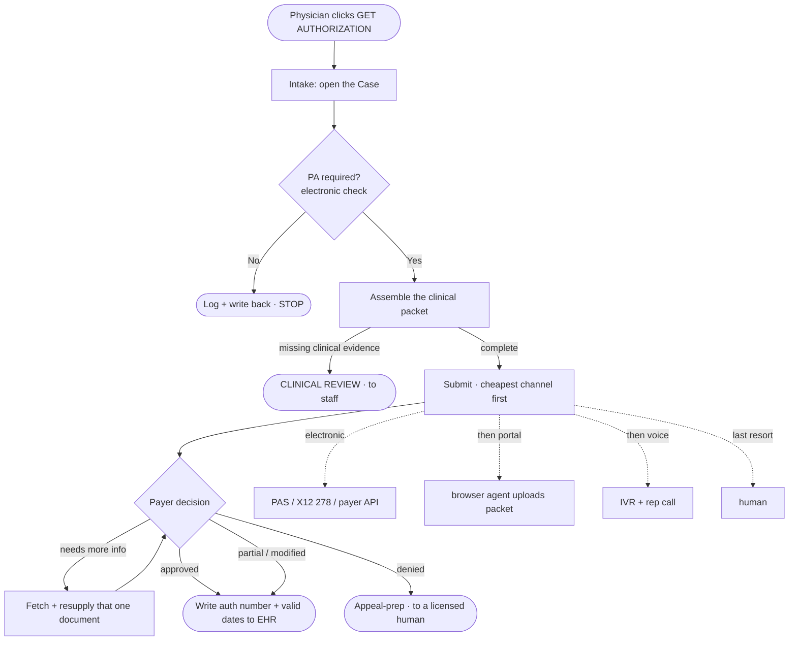

# ClearAuth — A Prior-Authorization Request, End to End

This document follows **one prior-authorization request through its entire life** — from the moment a physician
asks for it to the moment it's resolved and written back into the chart. It's told from the **user's point of
view** (what the practice sees and does), and every stage also opens up the **mechanism underneath** — which agent
role, which connector, and which standard actually does the work.

**Who the "user" is.** Two people, really: the **ordering physician**, who just wants the authorization and clicks
one button — *GET AUTHORIZATION* — and the **practice / RCM staff**, who should only ever see the cases that are
actually stuck. The promise ClearAuth makes to them is simple: *hand us the order; only bring us what genuinely
needs a human decision.* And the line it never crosses: **the agent does the paperwork; it never makes the medical
judgment.**

**How to read each stage.** Two lenses:

- **▶ What happens** — the user/business view.
- **⚙ Under the hood** — the agent role, connector, and standard; and how the request's internal record (its
  *Case*) moves.

A single example runs through the whole document so it reads as one story: **a lumbar-spine MRI, CPT 72148**, ordered
for a patient — a high-volume, authorization-prone imaging order. Branches ("if instead…") are shown at the point
where they split off, so the main line stays straight.

A final section — **The platform around the flow** — steps back from the single request to the platform it runs on:
identity and multi-tenancy, notifications, the patient's journey, and how the whole thing is billed.

---

## The cast

**People**
- **Ordering physician** — places the order / clicks *GET AUTHORIZATION*.
- **Practice / RCM staff** — see only exceptions and decisions, each pre-filled with context.
- **Clinical reviewer** — the licensed staff member any medical-necessity question escalates to.
- **Payer** — reached through its portal, its API, or a live representative on the phone.

**The ClearAuth agent — and its internal roles.** To the user it's one agent. Under the hood it's a small set of
cooperating roles over a shared, rigid rules/terminology/policy layer they aren't trusted to recall from memory:

> **Orchestrator → Coverage · Clinical · Compliance → Decision (confidence score) → Submission → Follow-Up**

**Connectors.** Each external system the agent touches is a **swappable connector**, not a hard-wired integration —
interface types *API, MCP, browser automation, webhook, SFTP*. The core stays closed; a new payer or EHR is a new
connector, never a change to the engine.

| Connector | Reaches | Speaks |
|---|---|---|
| EHR / PM | patient, insurance, order, clinical docs; auth write-back | FHIR / API / MCP |
| Clearinghouse | eligibility, status, authorization | EDI 270/271/276/277/278 |
| Payer portals & APIs | authorization submission + status | Availity, Optum, UHC, direct; browser where no API |
| Voice | IVR navigation + live rep conversation | telephony (engine e.g. Retell/Vapi) |
| Document & fax | retrieve clinical packets; submit where no portal exists | files / fax |

**The spine.** Everything operates on one object — the canonical **Case** — moved by a **state machine**, with
every action recorded in a **reference/transaction ledger** and a **write-once audit log**.

---

## The journey at a glance

The same shape the client's own swimlane draws: the request runs down a **cost-ordered waterfall** — electronic
first, portal second, a phone call only when nothing else resolves it, a human only for what isn't administrative.

---

## The walkthrough

### 1. The request starts — "GET AUTHORIZATION"

**▶ What happens.** The physician orders the MRI (lumbar spine, CPT 72148) or clicks *GET AUTHORIZATION*. The agent
immediately has what it needs — patient, insurance, CPT, diagnosis, and the physician's order. The practice does
nothing further unless the packet is incomplete, in which case it's flagged right away rather than failing silently
later.

**⚙ Under the hood.** The request arrives through the **EHR/PM connector** (an API or MCP call, or an inbound FHIR
`ServiceRequest` / CDS Hooks `order-sign` where the EHR supports it). The **Orchestrator** opens a canonical
**Case** (state `RECEIVED`), stamps it with the tenant and an **idempotency key** (so a retry can never create a
second authorization), validates that the packet is complete enough to act on, and writes the first **audit** entry.

### 2. Does this need prior auth? — the electronic check

**▶ What happens.** The system answers one of two things: *"No authorization needed — here's the proof, logged with
source, date, and a reference number"* and stops, or *"Authorization required — proceeding."* Nothing is assumed.

**⚙ Under the hood.** Electronic is the cheapest, fastest lane, done in two parts: first **confirm active coverage**
via real-time eligibility (**X12 270/271**); then **determine whether this plan requires PA for CPT 72148** via the
payer API / clearinghouse / Availity or **X12 278** — or **Da Vinci CRD** (fired by CDS Hooks) where the payer
exposes the FHIR form that CMS-0057-F is pushing the industry toward by **Jan 1 2027**. The **Coverage** role drives
it, backed by the versioned **payer-requirement matrix** and a **policy knowledge base (RAG)** it looks rules up in
rather than recalling them. *"Not required" is a positive, evidenced assertion* — source and reference number
written to the record, never a silent default.

> **If instead no PA is required:** the result, source, date, and reference number are written back to the EHR, and
> the Case closes here — no portal, no call.

### 3. Assembling the packet — *document-gathering #1*

**▶ What happens.** The agent pulls together **exactly what this payer asks for** — the order, office/visit notes,
imaging history, and the supporting clinical documentation — and only escalates to a clinician if genuine clinical
evidence is missing. It is not dumping the whole chart at the payer.

**⚙ Under the hood.** Where the payer runs **Da Vinci DTR**, its documentation questionnaire renders and
**auto-fills from the chart** — structured fields via **CQL** logic, with document extraction for anything
unstructured. Where it doesn't, the agent assembles the same clinical packet for portal or fax upload. Either way
the rule is **minimum-necessary by construction**: only the payer-required items, not the entire record (PA is a
HIPAA *"payment"* disclosure, so the treatment exception does not apply). The **Clinical** and **Compliance** roles
validate evidence and completeness in parallel; the Case moves to `DOCUMENTATION`. Reads come through the **EHR/PM**
and **Document & fax** connectors.

> **If instead clinical evidence is missing** — say the chart shows no six weeks of conservative therapy — the Case
> is flagged **"CLINICAL REVIEW REQUIRED"** and handed to staff, pre-filled with the agent's findings. *The agent
> never decides medical necessity; that always goes to a licensed person.*

### 4. Submitting — cheapest channel first

**▶ What happens.** The request goes out the fastest way *this* payer supports, and the staff screen simply shows
"submitted" with a tracking reference.

**⚙ Under the hood.** The **Decision** role first consolidates the Clinical/Compliance findings and scores
confidence — above the threshold it auto-submits; below it (or on any denial risk) it routes to a human first. Then
the **Submission** role runs the **waterfall**:

1. **Electronic** — **Da Vinci PAS** `Claim/$submit` (FHIR) where available, else **X12 278** or the payer API.
2. **Payer portal** — a **browser agent** enters the details and uploads the packet, when electronic can't resolve it.
3. **Voice** — a voice engine (e.g. **Retell/Vapi**) navigates the IVR, holds, and talks to the representative
   (*"I'm calling on behalf of Dr. Smith regarding a prior authorization…"*), when the portal can't.
4. **Human** — last resort.

**Inquire-before-submit plus the idempotency key means no duplicate PA.** A **decision-deadline timer** starts
(72 hours expedited / 7 days standard). The Case moves to `SUBMITTED`.

### 5. Waiting — and the mid-process document demand — *document-gathering #2*

**▶ What happens.** Many payers come back part-way through asking for *more*. The system fetches **that specific
document** and resupplies it **without restarting the request**, pulling in staff only if the new ask needs clinical
input.

**⚙ Under the hood.** A **pended** FHIR response opens a **Da Vinci CDex** additional-information loop; or the portal
pends, or the representative lists the gaps on the call. The **Follow-Up** role records the reason and the
reference/call number, retrieves *just that* permitted document from the EHR/document system, resupplies it through
the right channel, and sets a follow-up (e.g. **recheck in 10 days**). This is the client's *"we need the operative
report → retrieve it → submit it"* pattern, applied to prior auth. If the gap turns out to be clinical evidence that
doesn't exist, it routes to clinical review instead.

### 6. The outcome & write-back

**▶ What happens.** Staff see only the result — **"MRI L-Spine — APPROVED · Auth # · Valid Aug 26–Sep 26 · Ref #"**
— or an exception. What they see is a defined, small set of statuses: *No authorization required · Submitted–pending
· Approved · Clinical review required · Expiring soon.*

**⚙ Under the hood.** On **approval**, the authorization number, valid-from/valid-to dates, and reference number are
**written back to the EHR**, and an **expiry/units timer** surfaces any approval nearing its lapse before the
procedure date. **Partial / modified** (fewer units or a changed code) is a first-class outcome, not a yes/no. On
**denial**, the Case goes to **appeal-prep** and — by policy — **every denial routes to a licensed human**; the
agent never issues one. Outcomes feed back into the **policy KB** so the system gets more accurate over time. The
Case lands in `APPROVED` / `DENIED` and closes.

### 7. What actually reaches a human

**▶ What happens.** Staff only ever touch exceptions and decisions, each already loaded with the context behind it.

**⚙ Under the hood.** A per-case **confidence score** gates auto-versus-human, and a tenant-level **trust ramp**
controls how much runs unattended: **shadow** (agent proposes, human approves each) → **supervised auto-submit**
(low-risk actions go live) → **wider autonomy** — granted per action type, per workflow, and per payer, only as the
exception rate proves out. An **auto-submit threshold / kill-switch** is set by the Tenant Admin in configuration,
never a code change, and every change is itself an audited, versioned event.

### 8. The record left behind

**▶ What happens.** Long after the fact, every action is explainable — to staff, in an appeal, or in a payer
dispute.

**⚙ Under the hood.** A **write-once audit and reference/transaction ledger** ties every electronic check, portal
submission, and phone call to a timestamp, a source, a reference number, and — for calls — a recording and
transcript. It's the same record used for compliance review and for arguing a dispute with a payer.

---

## Threads that run through all of it

- **Cost-ordered waterfall** — electronic → portal → voice → human is the spine of every stage, not a special case.
- **Minimum-necessary disclosure** — only what the payer's requirements ask for ever leaves the chart (stage 3).
- **No duplicate submission** — inquire-before-submit + idempotency key (stage 4).
- **The standards layer under the electronic lane** — Da Vinci CRD/DTR/PAS/CDex and X12 270/271 & 278 power the
  electronic step today and become mandatory for impacted payers under **CMS-0057-F** on Jan 1 2027 (stages 2–5).
- **Reliability** — decision-deadline timers, scheduled rechecks, and channel fallback keep a request moving when a
  payer stalls (stages 4–5).
- **No medical judgment** — missing documentation and unusual denials always escalate to a licensed human (stages 3, 6).

---

## The whole journey, in one paragraph

A physician clicks **GET AUTHORIZATION** on an MRI order. ClearAuth opens a Case, confirms coverage and asks the
payer electronically whether CPT 72148 even needs authorization — if not, it logs the proof and stops. If it does,
the agent assembles exactly the clinical packet the payer requires (escalating to a clinician only when real
evidence is missing), then submits it the cheapest way that payer supports — **electronic, then portal, then a phone
call, then a human** — without ever creating a duplicate. When the payer asks for more mid-review, the agent fetches
just that document and resupplies it without starting over. The outcome comes back — approved, partially approved,
or denied — the authorization number and valid dates are written back into the chart, and the practice sees only the
result or the one exception that genuinely needs a person. Every step along the way is written, once, to an audit
trail that can be replayed later. In the client's own shorthand: **EHR → eligibility/clearinghouse → payer portal →
voice → documentation → EHR** — and the doctor never had to care how it got done.

---

## The platform around the flow

The request above runs on a shared platform. Four platform concerns surround every case: **who may act**, **who
gets told what**, **the patient's end-to-end picture**, and **how it's all paid for**.

### Identity, access & multi-tenancy — Keycloak

**▶ What happens.** Each practice is its own **tenant** — its users, its data, and its audit log walled off from
every other tenant. Staff sign in once (with MFA, or their health system's single sign-on) and see only their
persona's queue — **operations** or **clinical** — and nothing belonging to anyone else.

**⚙ Under the hood.** **Keycloak** is the identity provider, and it does all three jobs:
- **Authentication** — OIDC / OAuth2 login, **MFA before any PHI is touched**, and SAML / SSO federation for
  health-system customers that bring their own identity.
- **Authorization** — role-based access via Keycloak **roles / groups + token scopes**, deliberately kept to a small
  persona set (below); Keycloak also issues the **SMART-on-FHIR scopes** the EHR connector presents on reads and
  write-backs.
- **Multi-tenancy** — **one Keycloak realm (or isolated group) per tenant**, so identity, roles, and sessions are
  tenant-scoped by construction. A user in Tenant A can never be authorized into Tenant B. *This is what makes the
  application genuinely multi-tenant* — it matches the logical-isolation and tiered admin model the client
  specified; a dedicated/air-gapped customer simply gets its own realm in its own deployment.

**The personas.** A practice sees **two end-user personas plus an admin**, with the platform operator (us) sitting
above every tenant:

| Persona | Who | Sees / does |
|---|---|---|
| **Staff / Operations** | the practice's queue workers (billing + front-desk combined) | works the exception queue — status, submissions, document follow-up, administrative exceptions |
| **Clinical reviewer** *(licensed)* | a licensed clinician | medical-necessity, peer-to-peer, and denial escalations — kept a **distinct persona on purpose** so only licensed people make, and are audited for, medical calls |
| **Tenant Admin** | the practice's own admin | users, rules/thresholds, the tenant's audit log |
| **Master Admin** | the platform operator (us) | tenants, connector registry, cross-tenant health — **never PHI**; above all tenants, not something the customer sees |

One person can hold several of these — a solo practice can be Staff + Clinical + Admin in a single login, so a lean
persona set never forces extra headcount.

**One portal, shaped by role.** There is a **single ClearAuth portal** — one staff-facing application (distinct from
the *payer* portals the agent drives in the waterfall), not a separate app per persona. Everyone signs into the same
application, and **what they see is driven by their Keycloak roles/scopes (RBAC)**: the same portal renders the
**operations** queue for Staff, the **clinical-review** queue for a Clinical reviewer, and the **users / rules /
audit** views for the Tenant Admin — the navigation, screens, and the data each request returns all adapt to the
token's roles. (Master Admin's cross-tenant, no-PHI console is the same application, gated to the platform-operator
role.) Someone holding several roles sees the union of their views; no one ever sees what their roles don't grant.

### Notifications — email & web push

**▶ What happens.** Staff don't have to sit and watch a queue. The moment a case needs them — an exception, a
decision, a looming deadline — they're told, by **email** and by **web push** into the dashboard.

**⚙ Under the hood.** The same **domain events** that move a Case (status changed, info requested, decision
received, deadline at risk, approval expiring) fan out to a notification service, which delivers **email**
(transactional) and **web push** (browser service-worker). Two rules govern it: notifications are **preference- and
role-scoped** — each user chooses what reaches them — and **no PHI travels in the email or push payload**. A message
says *"a case needs your attention"* and links back into the app, where access is re-checked; the clinical detail
never sits in an inbox or a push message. Typical triggers map straight onto the flow: *clinical-review required*
(stage 3), *more info requested* (stage 5), *approved / denied* and *approval expiring soon* (stage 6), *follow-up
due* (stage 5).

### The patient's journey

**▶ What happens.** A prior auth isn't an isolated errand — it's one step in a patient actually getting care. The
**patient-journey** view ties each authorization to the patient's upcoming procedure and shows where they are:
*ordered → authorizing → approved → scheduled* (or *stuck — needs review*). Staff get one place to answer *"is Mrs.
Lee's MRI cleared for Tuesday?"* without digging through cases.

**⚙ Under the hood.** Every Case is linked to the patient and their order(s), so the platform keeps a
**longitudinal timeline per patient** across all of their authorizations — reusing the states, reference numbers,
and valid-through dates the flow already captured, assembled into one view. Looking ahead, this is also the surface
that feeds **CMS-0057-F's Patient Access API** (patients pulling their own PA status and history from 2027).
Anything patient-facing stays consent-gated and runs *through* the practice — ClearAuth is provider-facing, so the
patient **benefits** (faster care, fewer delays) rather than operating it directly.

### Billing, payments & invoicing — Stripe

**Who pays, and for what.** The customers are **provider-side** — the practices, rehab centers, and health systems
that run ClearAuth, in tiers by size (Starter → Growth → Scale → Enterprise → Enterprise+). Payers are the
counterparty, not customers; patients benefit but don't pay. The discovery already fixes a concrete model, priced by
**physician count and integration complexity, not per PA**:

| Component | Type | Shape |
|---|---|---|
| **Onboarding** | One-time | Tiered by complexity — ~**$3.5K** (Starter: ≤10 physicians, 1 EHR, ~3 payer routes, 2 portals) up to ~**$20K** (Enterprise+: ~250 physicians) |
| **Annual license** | Recurring subscription | Tiered — ~**$15K/yr** (Starter) to ~**$175K/yr** (Enterprise+); per-physician rate falls with scale (~$125 → ~$58 / physician / month) |
| **Managed services + cloud** | Recurring, **flat** | ~**$3,000 / customer / month** — hosting, the platform, baseline run cost |
| **Net-new integration** | One-time, hourly | Custom EHR / payer / portal / voice work at **$50/hr**; once a connector is reusable, later customers don't re-pay its build |
| **Pass-through usage + support** | Recurring, variable | Clearinghouse/EDI, voice/telephony, and model-API costs passed through; support/SLA by tier |

**So — subscription, one-time, or credits?** As documented, it's a **subscription model** (a tiered annual license
plus a flat monthly managed-services/cloud fee) **plus one-time onboarding and integration charges** — a classic
SaaS license, *not* per-PA and *not* a credits product. (The **$4-per-PA** figure that appears in the market model
is only a TAM/SAM **sizing** device, never the billing mechanism.) The one place **credits** could sensibly fit is
as an **optional** way to meter the *variable pass-through costs* — voice minutes, EDI transactions, model usage —
for customers who'd rather pay for exactly what the agent consumes than see it folded into the flat fee; weighted by
channel (a voice call costs far more than an electronic check), that also prices the waterfall honestly. **This is an
option to layer on, not the documented plan** — flagged here so the business can decide, not presented as settled.

**⚙ Under the hood.** **Stripe** runs it: **Stripe Billing** for the recurring pieces (the annual license + the flat
monthly managed-services fee), **Stripe Invoicing** for the one-time onboarding and net-new-integration charges
(card or ACH, net terms for enterprise), and **usage-based (metered) billing** only if the optional pass-through /
credits layer is adopted. One Stripe customer per tenant; every invoice line traces back to the flow's
**reference/transaction ledger**, so a usage line ("48 voice calls, 1,260 electronic checks") can be audited down to
the exact cases that produced it.
