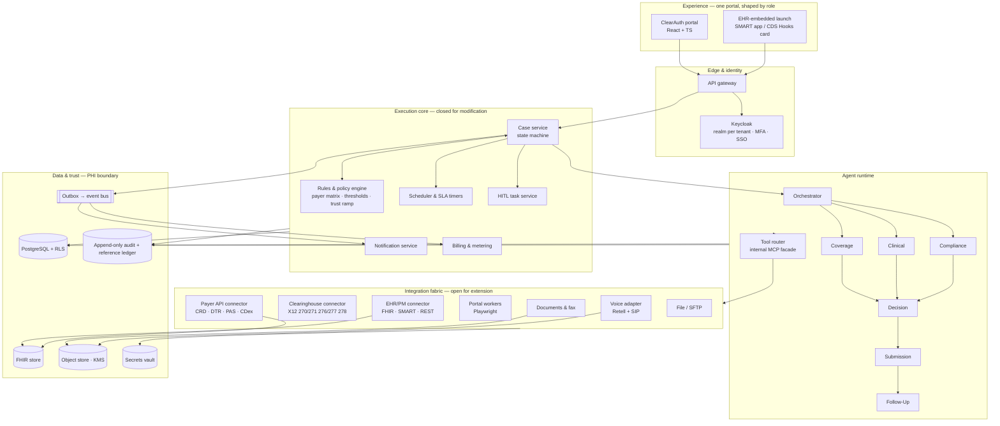
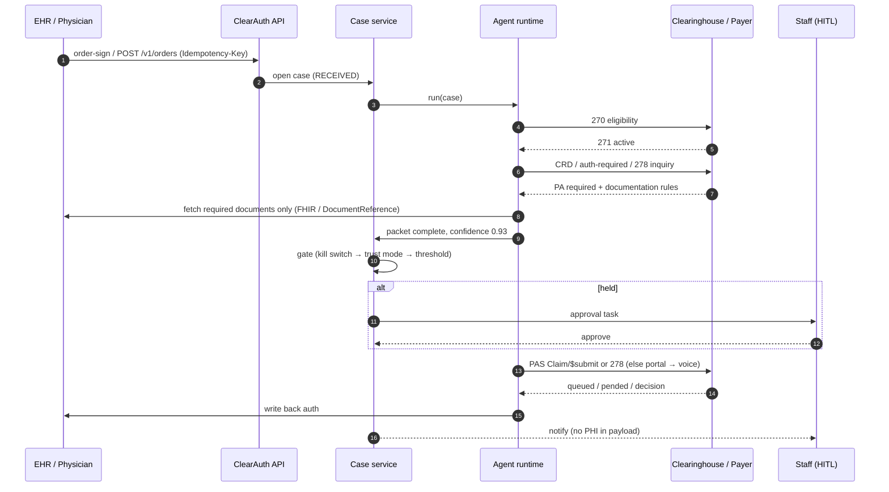
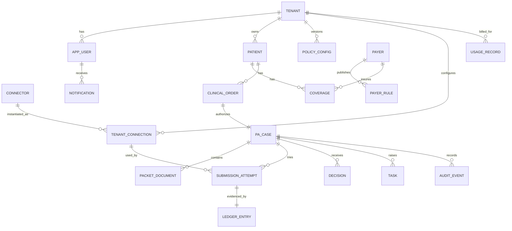
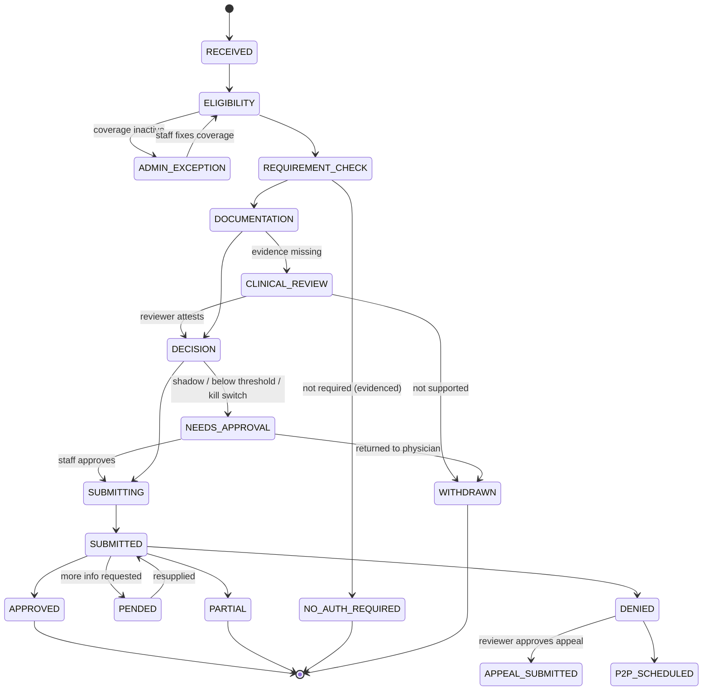

# ClearAuth AI: Suggested Solution Blueprint

**Users, data model, architecture and build plan for the prior-authorization agent, with VICE (A/R recovery) as the second agent on the same platform**

| | |
|---|---|
| Version | 1.0, 1 October 2026 |
| Status | Proposal for review. Nothing here is implemented or certified. |
| Companion | `prototype/clearauth-prototype.html`, a clickable frontend-only prototype with synthetic data |
| Built from | Everything in `medblock-pr-auth-study/` (source list in Appendix C) |

---

## Contents

1. [Recommendation in one page](#1-recommendation-in-one-page)
2. [What the folder already decided, and where it disagrees](#2-what-the-folder-already-decided-and-where-it-disagrees)
3. [Problem, goals and success measures](#3-problem-goals-and-success-measures)
4. [Scope of the first release](#4-scope-of-the-first-release)
5. [Users and permissions](#5-users-and-permissions)
6. [Key journeys](#6-key-journeys)
7. [Functional requirements by module](#7-functional-requirements-by-module)
8. [Architecture](#8-architecture)
9. [Data model](#9-data-model)
10. [API and event design](#10-api-and-event-design)
11. [Agent design](#11-agent-design)
12. [Integration plan](#12-integration-plan)
13. [Security, privacy and compliance](#13-security-privacy-and-compliance)
14. [Technology stack and build-vs-buy](#14-technology-stack-and-build-vs-buy)
15. [Frontend: from prototype to product](#15-frontend-from-prototype-to-product)
16. [How we build it: phases, team, milestones](#16-how-we-build-it-phases-team-milestones)
17. [Testing and acceptance](#17-testing-and-acceptance)
18. [Risks](#18-risks)
19. [Decisions needed](#19-decisions-needed)
20. [Appendices](#20-appendices)

---

## 1. Recommendation in one page

**Build one small healthcare execution platform, not two bots.** ClearAuth AI (prior authorization) ships first. VICE (unpaid-claim follow-up) ships second on the same core. Both run on one **canonical case**, one **state machine**, one **audit ledger** and one **connector framework**.

The design rests on four commitments that every document in the folder agrees on:

1. **Cheapest channel first.** Electronic (FHIR PAS / X12 278 / payer API) → payer portal (browser agent) → voice call → human. The case stays the same object whichever channel resolves it.
2. **The agent does the paperwork. It never makes the medical call.** Medical necessity, peer-to-peer and every denial go to a licensed person, who is a distinct, audited role.
3. **Staff see only exceptions**, each one already loaded with the context behind it. They get five plain statuses: *No authorization required · Submitted–pending · Approved · Clinical review required · Expiring soon*.
4. **Autonomy is configuration, earned per payer.** A trust ramp runs Shadow → Supervised auto-submit → Wider autonomy. The Tenant Admin sets thresholds and the kill switch, and every change is versioned and audited.

**Recommended stack.** TypeScript end to end: a React portal plus a Node API as a modular monolith. PostgreSQL with row-level security per tenant runs a durable state machine with an outbox. Background workers handle connectors, Playwright drives portals, and Retell handles voice. Keycloak provides identity, a FHIR store (HAPI or Medplum) holds clinical data with source provenance, and Stripe handles billing. Everything runs on AWS under BAAs.

**First production target (8 weeks).** One practice, one EHR, one clearinghouse lane (Availity), a high-volume imaging CPT family (start with 72148), one or two portal fallbacks, one voice flow, in Shadow mode first. The calendar critical path is **contracting, payer enrollment and credentials, not code**, so start those in week 1.

**What not to do.** Don't put PHI through consumer no-code tools (the n8n cautionary case). Don't let AI deny care. Don't promise "live with every payer". Don't block MVP1 on FHIR PAS everywhere, but keep the connector contract FHIR-ready for the CMS-0057-F deadline of 1 January 2027.

---

## 2. What the folder already decided, and where it disagrees

### 2.1 Settled across the documents

| Topic | Settled position | Where |
|---|---|---|
| Product shape | One agent to the user; internally Orchestrator → Coverage · Clinical · Compliance → Decision → Submission → Follow-Up | `prior-authorization-study.md`, `clearauth-end-to-end-flow.md` |
| Channel order | Electronic → portal → voice → human | Client requirements PDF, Vision & Scope §1 |
| Human boundary | No medical judgment; every denial to a licensed human | Vision & Scope §4, §8; `pa-best-solution.md` §3 |
| Pilot shape | One workflow, one payer set, Shadow first | Vision & Scope §11; Roadmap §4 |
| Sequence | ClearAuth (months 0–2) → VICE (3–4) → platform/SMB (5–6), two PODs | `2_WHAT_ClearAuth_VICE_6_Month_Roadmap.html` |
| Tenancy | Multi-tenant SaaS by default, dedicated/air-gapped on request, three-tier admin | Vision & Scope §7; walkthrough §09 |
| Core architecture | Canonical case + state machine, connector SDK, rules engine, scheduler, HITL, audit | Roadmap §3–4; Blueprint v2 §13 |
| Standards | FHIR R4 + Da Vinci CRD/DTR/PAS/CDex where supported; X12 270/271, 276/277, 278 underneath | `pa-integrations.md`; `cms-0057-f.html` |
| Identity / billing | Keycloak (realm per tenant), Stripe | `clearauth-end-to-end-flow.md` |
| Data | Postgres state machine + outbox first; HAPI FHIR spike vs managed; AWS baseline | Blueprint v2 §13, §52, ADR-01..06 |

### 2.2 Contradictions to resolve before build

| # | Conflict | Sources | Suggested resolution |
|---|---|---|---|
| C1 | **Product name**: "ClearAuth AI" (discovery), "Nexauth AI" (marketing site `web/`), vendor named "Relay Health AI" and "InfiniAI", client "Cascade" | Vision & Scope; `web/README.md`; Roadmap | Pick one external brand before the marketing site and app diverge further. This blueprint uses ClearAuth. |
| C2 | **Pricing model**: the walkthrough says *pay-per-use, metered, no flat fee*. The end-to-end flow says *annual license + flat $3K/month managed services + one-time onboarding*. The costs page prices onboarding at ~$3–3.5K. | `4_HOW_…walkthrough` §12; `clearauth-end-to-end-flow.md` billing; `ClearAuth_AI_Onboarding_Costs_Breaktup.html` | Choose one. Recommended: license + flat managed fee + one-time onboarding, with pass-through usage itemized (credits optional). The data model supports both (`UsageRecord`). |
| C3 | **n8n** appears as the workflow layer in the onboarding cost model, while the research names an n8n PA template as a cautionary failure | Costs page; `pa-best-solution.md` §6 | Keep n8n (if at all) off the PHI path. Workflow lives in our own durable state machine. |
| C4 | **MCP's role**: listed as a customer-facing connector type in Vision & Scope §6, but the Roadmap says MCP should be an internal tool facade only | Vision & Scope; Roadmap §3 | MCP is internal: agents call connectors through MCP-style tools, and customers and payers integrate over FHIR/X12/REST/SFTP. |
| C5 | **Which agent first**: Vision & Scope asks the client to choose; the Roadmap and walkthrough say ClearAuth first | Vision & Scope §11; Roadmap §4 | ClearAuth first. It proves the waterfall with the client's own example (MRI 72148). |
| C6 | **Volume and ROI figures** (39–43 PAs per physician per week; $20–30 per manual PA; 20 min → 5 min) come from a search-result screenshot, and the research says vendor numbers are rarely independently verified | WhatsApp images; `pa-best-solution.md` §7 | Use them for sizing only. Baseline the pilot practice's own numbers during discovery (questions B6–B11). |

---

## 3. Problem, goals and success measures

**Problem.** A practice's staff spend 20–40 minutes per authorization moving between the EHR, clearinghouse, payer portals and phone queues. Missing documentation is found late. Approvals lapse before the procedure date. Every payer has different rules, and those rules live in people's heads.

**Goal.** "Hand us the order; only bring us what genuinely needs a human decision."

**Pilot success measures** (baseline each one against the practice's manual process during discovery; none is a guarantee):

| Measure | Why it matters |
|---|---|
| % of cases resolved with no staff touch, per payer lane | The core promise |
| Order received → submitted (median, p90) | Speed to care |
| % of missing-document cases detected **before** submission | Prevents pends and denials |
| First-pass approval rate vs baseline | Quality of the packet |
| Staff minutes per authorization (including review and correction) | Real effort saved |
| Exceptions by reason | Where to improve next |
| 100% of actions with source and reference ID | Auditability |
| Approvals that lapsed before the procedure date | Should trend to zero |

---

## 4. Scope of the first release

| In MVP1 (ClearAuth, weeks 1–8) | Later |
|---|---|
| Order intake via REST/webhook, CSV/SFTP and one EHR connector | Every major EHR; HL7 v2 interface engine |
| Eligibility (270/271) and auth-required check (Availity API / 278 / CRD where live) | National HIE, TEFCA |
| Packet builder with completeness check (DTR-style), minimum-necessary | Advanced OCR on scanned faxes; autonomous criteria suggestions |
| Decision confidence, thresholds, trust ramp, kill switch | Predictive analytics |
| Submission waterfall: one electronic lane, 1–2 portals, one voice flow, human task | Full portal catalog; many IVR maps |
| Pended / more-info loop, decision timers, rechecks, expiry timer | Pharmacy ePA (NCPDP SCRIPT) |
| Exception queue, clinical-review queue, case detail, patient journey | Visual workflow designer |
| Tenant admin: users and roles, rules, payer matrix, connections, audit | Self-serve onboarding marketplace |
| EHR write-back of result, auth #, dates and reference | Payment posting (835) for ClearAuth |
| Email + web push notifications (no PHI in payload) | SMS |
| Write-once audit and reference ledger, call recordings and transcripts | Cross-region active-active |
| Single tenant in production, multi-tenant-ready schema | Dedicated / air-gapped deployment tooling |

---

## 5. Users and permissions

### 5.1 Personas

| Persona | Who | Primary job | Lands on (prototype) |
|---|---|---|---|
| **Ordering physician** | Physician or APP placing orders | Click GET AUTHORIZATION; hear only results or clinical questions | My orders |
| **Operations staff** | Prior-auth coordinator, billing, front desk | Work administrative exceptions; approve held submissions while a payer is in Shadow | Today / Exception queue |
| **Clinical reviewer** *(licensed)* | MD, DO, NP, PA or licensed therapist as the practice designates | Medical-necessity gaps, denials/appeals, peer-to-peer | Clinical review |
| **Tenant admin** | Practice manager | Users, roles, thresholds, trust ramp, payer matrix, connections, audit, billing | Automation rules |
| **Platform operator** | Us | Tenants, connector registry, onboarding, cross-tenant health. **Never PHI.** | Tenants |
| *Patient (indirect)* | — | Benefits from faster care; status later via the CMS Patient Access API, consent-gated, through the practice | — |

One person can hold several roles (a solo practice can be physician + staff + admin). The UI shows the union of their roles, and the API enforces the same thing.

### 5.2 Permission matrix

| Permission | Physician | Operations | Clinical | Tenant admin | Platform op |
|---|:-:|:-:|:-:|:-:|:-:|
| Place order / GET AUTHORIZATION | ✓ | | | | |
| See case detail (PHI) | own orders | ✓ | ✓ | ✓ | |
| Work exception queue | | ✓ | | ✓ | |
| Approve held submission (Shadow / below threshold) | | ✓ | | | |
| Attest clinical evidence; mark not supported | | | ✓ | | |
| Approve appeal; request peer-to-peer | | | ✓ | | |
| Edit threshold, trust ramp, kill switch, payer overrides | | | | ✓ | |
| Manage users, roles, connections | | | | ✓ | |
| Read tenant audit log | | | | ✓ | |
| Manage tenants, connector registry, onboarding | | | | | ✓ |

Implementation: Keycloak realm per tenant; realm roles map to token scopes (`case:read`, `case:approve`, `clinical:attest`, `policy:write`, `platform:admin`…). The API checks the scope **and** `tenant_id` from the token on every request, and Postgres RLS enforces tenant again underneath.

---

## 6. Key journeys

Each journey below can be run in the prototype (Appendix A).

| # | Journey | What happens | Ends as |
|---|---|---|---|
| J1 | **Happy path, electronic** | Physician clicks GET AUTHORIZATION → case opened with idempotency key → 270/271 active → CRD/auth-required says PA needed → DTR-style packet complete → confidence 0.93 ≥ 0.90 → PAS/278 submit → decision timer → approved → auth #, dates and reference written back to the EHR | Approved |
| J2 | **No auth required** | Requirement check returns "not required" with source and reference → written to the chart → stop | No authorization required |
| J3 | **Clinical gap** | Packet missing 6 weeks of conservative therapy → CLINICAL REVIEW REQUIRED → licensed reviewer attaches PT notes found in the chart and attests → agent resumes at Decision → submits | Approved (or Withdrawn if not supported) |
| J4 | **Shadow approval** | Payer in Shadow (or confidence below threshold, or kill switch on) → Needs approval → ops approves → waterfall runs | Approved |
| J5 | **Portal fails, voice succeeds** | No electronic route → browser agent fails (session timeout) → voice agent navigates IVR, discloses as automated where the payer permits, gets a reference number → transcript stored | Submitted–pending → Approved |
| J6 | **Mid-review document demand** | Payer pends (CDex Task / portal note / rep) → Follow-Up retrieves that one document → resupplies without restarting → recheck date set | Approved |
| J7 | **Denial** | Denial (e.g. CARC 50) → always to a licensed human → appeal packet drafted with the omitted evidence → reviewer approves the appeal or requests a peer-to-peer | Appeal submitted / P2P scheduled |
| J8 | **Expiring approval** | Expiry timer sees valid-to before the procedure date → Expiring soon → ops asks the agent to request an extension | Approved (extended) |
| J9 | **Inactive coverage** | 271 shows coverage terminated → admin exception → ops updates coverage → re-run from eligibility | Continues J1 |
| J10 | **Duplicate prevention** | Same patient + CPT ordered twice → inquire-before-submit + idempotency → existing case opened, no second PA | Existing case |

---

## 7. Functional requirements by module

**Intake**
- FR-1 Accept orders through `POST /v1/orders` (REST/webhook), CSV/SFTP drop, or the EHR connector (FHIR `ServiceRequest`, CDS Hooks `order-sign`).
- FR-2 Validate the minimum packet (patient, coverage, CPT, ICD-10, ordering provider, date). If incomplete, raise an admin exception right away.
- FR-3 Stamp tenant, idempotency key (`tenant + order_id + cpt`) and correlation ID. Reject or merge duplicates.

**Coverage and requirement**
- FR-4 Run eligibility (270/271) and store the result with the transaction number.
- FR-5 Determine PA requirement through, in order, CRD (if the payer is live) → clearinghouse auth-required API / 278 inquiry → versioned payer matrix. Record which source answered and its version.
- FR-6 "Not required" is a positive, evidenced assertion: write it back with source, date and reference.

**Packet**
- FR-7 Build the document list from the matched rule. Fetch only those items (minimum necessary).
- FR-8 Fill DTR questionnaires from structured FHIR data (CQL where provided) plus LLM extraction for unstructured notes, every answer linked to its source document and span.
- FR-9 Flag missing clinical evidence → CLINICAL_REVIEW, with findings stated as facts and gaps, never as a necessity verdict.

**Decision and gate**
- FR-10 Compute a confidence score from defined components (§11.3) and store the inputs.
- FR-11 Apply the tenant gate: kill switch → trust mode for this payer and workflow → threshold. If held, create an approval task.

**Submission waterfall**
- FR-12 Inquire before submit. Never create a second authorization for the same order.
- FR-13 Try channels in the payer's profile order. Each attempt is a `SubmissionAttempt` with outcome and external reference.
- FR-14 Voice: check the payer's automated-caller permission and the state's recording-consent rule before dialing. Store the recording and transcript.
- FR-15 Start the decision timer (72 h expedited / 7 days standard, configurable) at submission.

**Follow-up**
- FR-16 Poll or receive status. Handle pends by fetching and resupplying the requested item. Set rechecks.
- FR-17 Treat partial/modified approvals (units, dates, code changes) as a first-class outcome.
- FR-18 Write back auth #, valid-from/to, units and reference to the EHR. Start the expiry timer against the procedure date.
- FR-19 Route every denial to the clinical queue with an appeal draft and the deadline.

**Work surfaces**
- FR-20 Ops: dashboard, exception queue with reasons, case detail (stages, channels, packet, transcript, audit), patient journey.
- FR-21 Clinical: queue, findings, evidence attestation, appeal approval, peer-to-peer request.
- FR-22 Physician: my orders, outcomes, clinical questions only.

**Administration**
- FR-23 Users and roles; invite with MFA/SSO.
- FR-24 Threshold, trust ramp per payer and workflow, kill switch, timers, escalation owner. Every change versioned and audited.
- FR-25 Payer matrix view with version and source; tenant overrides.
- FR-26 Connections with state (`active / failed / refresh_failed / expired / disconnected`), test and reconnect.
- FR-27 Audit log search and export.
- FR-28 Billing: plan, invoices, itemized pass-through usage.

**Platform**
- FR-29 Tenants list with health, volume, touchless rate and exception rate. No PHI.
- FR-30 Connector registry with versions, tenants using each, and health/change alerts.
- FR-31 Onboarding: questionnaire → registry match → credentials → validate → shadow → live.

**Notifications**
- FR-32 Domain events fan out to email and web push, scoped by role and preference, with **no PHI in the payload**. Links lead back into the app, where access is re-checked.

---

## 8. Architecture

### 8.1 Logical architecture



### 8.2 Design rules

1. **Canonical case, many channels.** API, portal, voice and human are attempts on one case. They never become separate bots or separate records.
2. **Core closed, connectors open.** A new client's EHR or payer is a new connector implementing the contract in §10.3, never a branch in the core.
3. **LLMs reason; rules decide.** Agents read, extract, classify and draft. Payer requirements, thresholds, routing and deadlines come from the versioned rules engine, which the LLM cannot override.
4. **Durable by default.** State changes and outbound events commit in one transaction (outbox). Workers are idempotent. Timers survive restarts. Nothing depends on a browser tab staying open.
5. **Two storage layers.** Immutable raw (what the source sent: FHIR bundle, 271, transcript) and a derived, normalized case model, linked by provenance (the Medblocks lesson).
6. **Connections are stateful.** Track and surface `active / failed / refresh_failed / expired / disconnected`, and act on state, not on whether an OAuth flow once finished.
7. **Modular monolith first.** One deployable API with clear modules, plus separately scaled workers (connectors, portal, voice). Split into services only when load or team boundaries demand it.

### 8.3 Request path for one GET AUTHORIZATION



### 8.4 Deployment (AWS baseline)

| Concern | Choice |
|---|---|
| Compute | ECS Fargate: `api`, `worker-connectors`, `worker-portal` (Playwright, isolated), `worker-voice` |
| Data | RDS PostgreSQL (Multi-AZ), S3 with SSE-KMS (customer-managed keys), SQS for work queues, EventBridge or Postgres outbox relay for domain events |
| FHIR | HAPI FHIR JPA on ECS, or Medplum, or AWS HealthLake. Decide after the Blueprint's spike (ADR-06) |
| Identity | Keycloak on ECS (or a managed Keycloak), realm per tenant |
| Secrets | AWS Secrets Manager / KMS envelope encryption, credentials per connector |
| Network | Private subnets, VPC endpoints / PrivateLink, no PHI over the public internet where avoidable |
| Observability | OpenTelemetry → CloudWatch / Grafana, with PHI scrubbing at the collector |
| Environments | `dev` (synthetic only) → `uat` (synthetic + sandbox payers) → `prod`. Separate accounts. |
| Dedicated tier | The same IaC (Terraform) deployed into a customer VPC |

---

## 9. Data model

### 9.1 Entity overview



Sensitivity: **PHI** = patient data, **CFG** = configuration, **SEC** = secret reference.

| Entity | Key fields | Class |
|---|---|---|
| `tenant` | tenant_id, name, tier, deployment_mode, region, status | CFG |
| `app_user` | user_id, tenant_id, keycloak_sub, name, email, roles[], mfa_enrolled | CFG |
| `policy_config` | tenant_id, version, threshold, kill_switch, trust_by_payer_workflow, timers, escalation_owner, changed_by, changed_at | CFG |
| `patient` | tenant_id, patient_id, source_ids[], mrn, name, dob | PHI |
| `coverage` | coverage_id, patient_id, payer_id, member_id, plan, active, verified_at, source_ref | PHI |
| `clinical_order` | order_id, patient_id, provider_npi, cpt, icd10[], scheduled_date, fhir_ref | PHI |
| `payer` | payer_id, name, routes[], portal, automated_caller_ok, recording_consent_rule | CFG |
| `payer_rule` | rule_id, payer_id, plan, cpt, pa_required, docs_required[], channel_pref, version, source, effective_from/to | CFG |
| `pa_case` | case_id, tenant_id, order_id, coverage_id, workflow (`clearauth`/`vice`), state, confidence, rule_version, idempotency_key, deadline_at, owner, version | PHI |
| `packet_document` | doc_id, case_id, type, required_by_rule, status, source_uri, sha256, extracted_answers | PHI |
| `submission_attempt` | attempt_id, case_id, channel, connection_id, outcome, external_ref, started_at, ended_at | PHI |
| `decision` | decision_id, case_id, type (approved/partial/denied/pended), auth_number, valid_from/to, units, reason_code, payer_ref | PHI |
| `task` | task_id, case_id, kind (approval/clinical_review/admin_exception/appeal/p2p/expiring), assigned_role, assignee, due_at, status, resolution | PHI |
| `connector` | connector_id, system, kind, interface, version, contract_version | CFG |
| `tenant_connection` | connection_id, tenant_id, connector_id, credential_ref, state, last_tested_at | SEC |
| `audit_event` | event_id, tenant_id, actor, actor_type, action, target, ref, ts, prev_hash | PHI-sensitive |
| `ledger_entry` | ref_id, case_id, attempt_id, kind, external_ref, recording_uri, transcript_uri | PHI |
| `notification` | notification_id, user_id, event_type, case_id, channel, read_at (no PHI) | CFG |
| `usage_record` | usage_id, tenant_id, kind, quantity, case_id, stripe_item | CFG |
| *plumbing* | `outbox_event`, `inbox_event`, `idempotency_record`, `connector_checkpoint` | — |

**VICE reuse.** VICE adds `claim` (claim_id, patient_id, payer_id, dos, billed_amount, age_days, timely_filing_deadline, status) and uses `pa_case.workflow = 'vice'` with its own states (`STATUS_CHECK → CALL → REASON_CAPTURED → RESOLVING → RECONCILED`). Attempts, ledger, tasks, audit, notifications and connectors are shared unchanged. That is the test of the platform claim.

### 9.2 Core DDL (PostgreSQL)

```sql
-- Every protected table: tenant_id first in the PK, RLS on.
CREATE TABLE pa_case (
  tenant_id        uuid NOT NULL,
  case_id          uuid NOT NULL DEFAULT gen_random_uuid(),
  order_id         uuid NOT NULL,
  coverage_id      uuid,
  workflow         text NOT NULL DEFAULT 'clearauth' CHECK (workflow IN ('clearauth','vice')),
  state            text NOT NULL,
  confidence       numeric(3,2),
  rule_version     text,
  idempotency_key  text NOT NULL,
  deadline_at      timestamptz,
  owner_user_id    uuid,
  version          bigint NOT NULL DEFAULT 1,          -- optimistic concurrency (If-Match)
  created_at       timestamptz NOT NULL DEFAULT now(),
  updated_at       timestamptz NOT NULL DEFAULT now(),
  PRIMARY KEY (tenant_id, case_id),
  UNIQUE (tenant_id, idempotency_key)                  -- no duplicate PA per order
);

CREATE TABLE submission_attempt (
  tenant_id     uuid NOT NULL,
  attempt_id    uuid NOT NULL DEFAULT gen_random_uuid(),
  case_id       uuid NOT NULL,
  channel       text NOT NULL CHECK (channel IN ('electronic','portal','voice','human')),
  connection_id uuid,
  outcome       text NOT NULL,
  external_ref  text,
  started_at    timestamptz NOT NULL DEFAULT now(),
  ended_at      timestamptz,
  PRIMARY KEY (tenant_id, attempt_id),
  FOREIGN KEY (tenant_id, case_id) REFERENCES pa_case (tenant_id, case_id)
);

CREATE TABLE audit_event (
  tenant_id   uuid NOT NULL,
  event_id    bigint GENERATED ALWAYS AS IDENTITY,
  ts          timestamptz NOT NULL DEFAULT now(),
  actor       text NOT NULL,                    -- user id or agent role
  actor_type  text NOT NULL CHECK (actor_type IN ('user','agent','system')),
  action      text NOT NULL,
  target      text NOT NULL,
  ref         text,
  payload     jsonb,
  prev_hash   bytea,                            -- hash chain for tamper evidence
  PRIMARY KEY (tenant_id, event_id)
);
REVOKE UPDATE, DELETE ON audit_event FROM app_role;   -- write-once

CREATE TABLE outbox_event (
  id          bigint GENERATED ALWAYS AS IDENTITY PRIMARY KEY,
  tenant_id   uuid NOT NULL,
  aggregate   text NOT NULL,
  type        text NOT NULL,          -- case.state_changed, case.info_requested, ...
  payload     jsonb NOT NULL,         -- IDs only; no PHI
  created_at  timestamptz NOT NULL DEFAULT now(),
  published_at timestamptz
);

ALTER TABLE pa_case ENABLE ROW LEVEL SECURITY;
CREATE POLICY tenant_isolation ON pa_case
  USING (tenant_id = current_setting('app.tenant_id')::uuid);
```

### 9.3 Case state machine



Transitions are declared in one table (`from, to, guard, actor_kind`). The case service rejects anything not in that table. "Expiring soon" is a **derived** flag (`valid_to < scheduled_date`) raised by the expiry timer, not a separate state.

### 9.4 FHIR mapping

| Concept | FHIR R4 resource | Notes |
|---|---|---|
| Patient / ordering provider / payer | `Patient`, `Practitioner`, `Organization` | US Core profiles |
| Insurance | `Coverage` | from 271 or EHR |
| Order | `ServiceRequest` (`DeviceRequest` for DME) | CPT in `code` |
| Evidence | `Condition`, `Observation`, `DiagnosticReport`, `Procedure`, `DocumentReference` | linked via `Provenance` |
| Payer questionnaire / answers | `Questionnaire` / `QuestionnaireResponse` | Da Vinci DTR |
| PA request / response | `Claim` (use = preauthorization) / `ClaimResponse` | Da Vinci PAS bundle |
| Pend / more info | `Task` | Da Vinci CDex |

The business API (`/v1`) owns cases. `/fhir/R4` exposes only the supported interactions. Internal states are never conflated with FHIR status codes.

---

## 10. API and event design

### 10.1 Business API (`/v1`)

| Method | Path | Purpose | Roles |
|---|---|---|---|
| POST | `/v1/orders` | Create order and open a case. Requires `Idempotency-Key`. | physician, integration |
| GET | `/v1/cases?status=&queue=&payer=` | List / filter cases | staff, clinical, admin, physician (own) |
| GET | `/v1/cases/{id}` | Case detail: stages, packet, attempts, decision, timeline | same |
| POST | `/v1/cases/{id}/approve-submission` | Release a held case (`If-Match: version`) | staff |
| POST | `/v1/cases/{id}/return` | Return to physician | staff |
| POST | `/v1/cases/{id}/coverage` | Update coverage and re-run eligibility | staff |
| POST | `/v1/cases/{id}/clinical-attestation` | Attach evidence + attest, or mark not supported | clinical |
| POST | `/v1/cases/{id}/appeal` | Approve appeal packet | clinical |
| POST | `/v1/cases/{id}/peer-to-peer` | Request P2P | clinical |
| POST | `/v1/cases/{id}/extension` | Request date-span extension | staff |
| GET/PUT | `/v1/policy` | Read / write threshold, trust ramp, kill switch (versioned) | admin |
| GET | `/v1/payer-rules` | Matrix with versions and sources | admin, staff |
| GET/POST | `/v1/connections`, `/v1/connections/{id}/test` | Connection state and test | admin |
| GET/POST | `/v1/users`, `/v1/users/{id}/roles` | Users and roles (proxied to Keycloak) | admin |
| GET | `/v1/audit?target=&actor=&from=` | Audit search/export | admin |
| GET | `/v1/platform/tenants`, `/v1/platform/connectors` | Cross-tenant, no PHI | platform |

Conventions: OAuth2 bearer from Keycloak; `tenant_id` comes from the token, never the URL. Write calls take `Idempotency-Key` and `If-Match`. Long work returns `202` with an operation ID. Errors use RFC 9457 problem+json.

### 10.2 Domain events (outbox → bus → notifications, billing, webhooks)

`case.opened` · `case.state_changed` · `case.info_requested` · `case.clinical_review_required` · `case.approval_required` · `case.decision_received` · `case.approval_expiring` · `case.followup_due` · `connection.state_changed` · `policy.changed` · `usage.recorded`

Payloads carry IDs and types only. Consumers re-read through the API with their own authorization.

### 10.3 Connector contract

```ts
export interface Connector {
  describe(): ConnectorManifest;                  // kind, interface, capabilities, version
  test(conn: ConnectionRef): Promise<HealthResult>;
  checkEligibility?(req: EligibilityReq): Promise<EligibilityResult>;      // 270/271
  checkRequirement?(req: RequirementReq): Promise<RequirementResult>;      // CRD / 278 inquiry / API
  fetchDocuments?(req: DocumentReq): Promise<DocumentRef[]>;               // EHR / document store
  submit?(req: SubmissionReq): Promise<SubmissionReceipt>;                 // PAS / 278 / portal / voice
  getStatus?(ref: ExternalRef): Promise<StatusResult>;
  writeBack?(req: WriteBackReq): Promise<void>;
  onEvent?(handler: (e: ConnectorEvent) => Promise<void>): void;           // webhooks / pends
}
```

Every method is idempotent with respect to the request's idempotency key, emits a `ledger_entry`, and maps native errors to a shared taxonomy (`auth_expired`, `rate_limited`, `payer_unavailable`, `validation_failed`, `ui_changed`, …). Agents call connectors through the tool router (an internal MCP-style facade). Customers and payers never see MCP.

---

## 11. Agent design

### 11.1 Roles and boundaries

| Role | Does | Tools | May not |
|---|---|---|---|
| Orchestrator | Opens case, sequences roles, applies state transitions | case service | Skip the gate |
| Coverage | Eligibility, requirement, rule lookup | clearinghouse, payer API, rules engine | Recall rules from memory |
| Clinical | Extract evidence, fill questionnaires, list gaps | EHR/FHIR read, document fetch, LLM extraction | Judge medical necessity |
| Compliance | Minimum-necessary, consent, completeness, call-disclosure checks | rules engine | Release PHI beyond the rule's list |
| Decision | Confidence score, recommendation | — | Deny, or override thresholds |
| Submission | Waterfall across channels | payer API, portal worker, voice adapter | Submit twice; call where automated callers are not permitted |
| Follow-Up | Status, pends, write-back, expiry, appeal drafting | all read tools, EHR write-back | Submit an appeal without human approval |

### 11.2 Model use

- **Default:** a frontier model via an API under a signed BAA (Claude or Gemini), used for extraction, classification, summarization and transcript structuring. Output is always **structured** (JSON schema), validated, with source spans.
- **PHI-boundary option:** MedGemma (open weights) self-hosted inside the tenant's VPC for extraction, passing only de-identified results onward. Use it when a customer requires that PHI never leaves their infrastructure (the dedicated tier). This is the "MedGemma as a PHI boundary" pattern in `medgemma-in-practice.html`.
- Deterministic first: if a FHIR field answers a question, no LLM call is made.
- Prompts and policies are versioned. Each case stores model and prompt versions alongside its rule version.

### 11.3 Confidence score

Score = weighted, explainable components, all stored on the case:

| Component | Example signal |
|---|---|
| Rule match | exact payer + plan + CPT rule found (vs fallback) |
| Packet completeness | required items present / required items |
| Extraction certainty | min confidence across questionnaire answers, each with a source span |
| Identity match | patient/member/provider identifiers agree across sources |
| Route reliability | historical success of this channel for this payer |
| Prior outcomes | approval rate for this payer + CPT in this tenant |

Start with fixed weights calibrated in Shadow mode against staff decisions. Report calibration (predicted vs actual) per payer before any payer moves out of Shadow.

### 11.4 Evaluation

- Golden set from the discovery data sample: real (de-identified) orders and outcomes per in-scope payer and CPT.
- Metrics: extraction accuracy per field, requirement-check accuracy, packet-completeness recall, call-outcome accuracy (transcript vs structured result), duplicate rate (must be 0).
- Workflow replay: re-run historical cases through a new rule, prompt or model version before promotion.
- Golden test calls for each IVR map, re-run on payer IVR changes.

---

## 12. Integration plan

| Phase | Connector | Mechanism | Difficulty | Note |
|---|---|---|---|---|
| MVP1 M1 | Generic REST + webhook | `/v1/orders`, signed webhooks | Easy | Default integration contract |
| MVP1 M1 | CSV / SFTP fast start | Schema-validated drops | Easy | Onboard in days |
| MVP1 M2 | Availity | REST: 270/271, 278, auth-required, attachments | Medium | Start commercial onboarding in week 1 |
| MVP1 M2 | One EHR (athenahealth or eCW for SMB; Epic only if the launch customer is Epic) | FHIR R4 + SMART backend services | Medium | Confirm exact write-back resources |
| MVP1 M2 | UHC/Optum PAS (if the pilot payer is live) | Da Vinci CRD/DTR/PAS | Medium | Otherwise X12 278 via Availity |
| MVP1 M3 | 1–2 payer portals | Playwright workers, isolated sessions, change detection | Hard to maintain | MFA and CAPTCHA handling; alert on UI change |
| MVP1 M3 | Retell voice | API + SIP, dedicated outbound line, recording | Easy–Medium | Persist our own structured outcome |
| MVP2 | 276/277 claim status, 835 ERA | Clearinghouse | Medium | VICE |
| MVP3 | Epic / Oracle Health, TriZetto | FHIR, X12 / SFTP | Medium–Hard | Enrollment drives the calendar |

**Promise the connector and sandbox readiness, not "live with payer X by week N".** Production access depends on contracts, enrollment and customer IT.

---

## 13. Security, privacy and compliance

- **BAAs** with every subprocessor that touches PHI (hosting, voice, model API, email if it ever carries more than a link) before any PHI enters.
- **Encryption** at rest (KMS, customer-managed keys for dedicated tier) and in transit (TLS 1.2+).
- **Identity**: MFA before any PHI; SSO/SAML for health systems; short-lived tokens; SMART scopes for EHR reads and writes.
- **Tenant isolation**: `tenant_id` in every key and index, Postgres RLS, per-tenant S3 prefixes and KMS keys, realm per tenant. Platform operator role has no PHI scopes.
- **Least privilege per agent**: each agent role gets only the tools and fields it needs (field-level policy, Cedar-style).
- **Minimum necessary**: only payer-required items leave the chart. PA is a payment disclosure, so the treatment exception does not apply.
- **Write-once audit** with hash chain; reference ledger; call recordings and transcripts kept per the practice's retention policy (commonly 6 years).
- **Call disclosure and consent**: automated-caller permission per payer; one- vs two-party recording consent per state, checked per call.
- **No PHI in notifications, logs or traces**; scrub at the OpenTelemetry collector.
- **Client data ownership**: exportable on request; never used to train a cross-tenant model without explicit opt-in.
- **Human approval** logged before any denial-related or above-threshold action.
- Target **SOC 2 Type I** before the external market launch (Phase 4), Type II after.

---

## 14. Technology stack and build-vs-buy

| Layer | Choice | Why |
|---|---|---|
| Frontend | React 19 + React Router 7 + TypeScript + Tailwind, TanStack Query | Matches the existing `web/` repo and its tokens |
| API | Node 22 + TypeScript (NestJS or Fastify), modular monolith | One language across UI, API and connectors |
| Workflow | Postgres state machine + outbox + pg-boss/BullMQ workers | Blueprint ADR-03. Revisit **Temporal** when timers and compensation outgrow it. |
| Database | PostgreSQL 16 with RLS | Cases, config, audit |
| FHIR store | HAPI FHIR JPA or Medplum (spike vs HealthLake) | Don't write FHIR persistence yourself |
| Identity | Keycloak | Realms per tenant, SAML/OIDC, MFA |
| Portal automation | Playwright workers | Isolated, observable, screenshot evidence |
| Voice | Retell AI (+ SIP carrier) | Channel adapter, not the system of record |
| LLM | Frontier model under BAA; MedGemma for the PHI-boundary option | §11.2 |
| Billing | Stripe Billing + Invoicing (+ metered usage if adopted) | One customer per tenant |
| Infra | AWS (ECS, RDS, S3, SQS, KMS, Secrets Manager), Terraform | Blueprint ADR-06 |
| Observability | OpenTelemetry, CloudWatch/Grafana, Sentry (scrubbed) | |

| Build | Buy / partner | Open source |
|---|---|---|
| Case engine, waterfall, rules/trust ramp, work surfaces, audit, connector contract | Clearinghouse reach (Availity), voice infrastructure (Retell), payer criteria content where licensed | FHIR server, Keycloak, Playwright, Medplum/HAPI |

---

## 15. Frontend: from prototype to product

The prototype is one HTML file with in-memory state. Its screens map directly onto the production app:

| Prototype view | Production route | Main components |
|---|---|---|
| Today | `/ops` | KpiStrip, ChannelMixBar, ExceptionTable, ActivityFeed |
| Exception queue | `/ops/queue?reason=` | QueueFilters, CaseTable |
| All cases | `/cases` | CaseSearch, CaseTable |
| Case drawer | `/cases/:id` (drawer route) | StageTracker, OutcomeBanner, FindingsList, ChannelWaterfall, PacketList, Transcript, AuditTimeline, CaseActions |
| My orders / New order | `/orders`, `/orders/new` (and SMART launch `/launch`) | OrderForm, GetAuthorizationButton |
| Patient journey | `/journey` | JourneyTrack |
| Clinical review | `/clinical` | ClinicalQueue, AttestationPanel, AppealPanel |
| Automation rules | `/admin/automation` | ThresholdSlider, KillSwitch, TrustRampTable, PolicyLog |
| Payer requirements | `/admin/payer-rules` | RuleMatrix, ChannelProfile |
| Connections | `/admin/connections` | ConnectionCard, TestButton |
| Users & roles | `/admin/users` | RoleMatrix, InviteForm |
| Audit log / Billing | `/admin/audit`, `/admin/billing` | AuditTable / InvoiceTable, UsageTable |
| Tenants / Registry / Onboarding | `/platform/*` | TenantHealthTable, RegistryTable, OnboardingPipeline |

**How to get there fast:** move the prototype's seed data into **MSW** (Mock Service Worker) handlers implementing the `/v1` contract in §10.1, so the real React app is built and demoed against mocks while the backend is built against the same OpenAPI spec. Role-shaped navigation comes from token scopes (`useScopes()`), never from client-side flags alone.

---

## 16. How we build it: phases, team, milestones

### 16.1 Phases

| Phase | Weeks | Deliverables | Exit criteria |
|---|---|---|---|
| **0 · Discovery & sign-off** | 0–2 (overlaps) | Run the 25-question discovery; pick payer + CPT family; baseline metrics; sign Vision & Scope; BAAs; **start Availity and payer enrollment**; resolve §19 decisions | Signed scope, baseline numbers, data sample, credentials requested |
| **1 · Core** | 1–2 | Case + state machine + outbox; audit; Keycloak realm; RLS; REST + CSV intake; ops dashboard + case drawer against a simulated payer | A synthetic order runs end to end on a simulated payer |
| **2 · Electronic lane** | 3–5 | Availity 270/271 + 278 / auth-required; one EHR connector (read + write-back); packet builder + DTR-style fill; pended loop; connection test UI | First real sandbox case moves with traceable status |
| **3 · Fallbacks + hardening** | 6–8 | 1–2 portal workers; Retell flow; clinical queue + approval gates; notifications; SLA alerts; security review; UAT | Electronic → portal → voice → human works as one workflow; Shadow pilot live |
| **4 · Shadow → Supervised** | 9–12 (runs alongside VICE build) | Compare agent vs staff on real cases; calibrate confidence; move the first payer to Supervised with written sign-off | Agreed acceptance thresholds met (§17) |
| **5 · VICE** | 9–16 | Claim case type; 276/277; prioritization; voice claim-status; reason classification; 835 reconciliation; recovery analytics | Second agent ships with **zero changes to the core** |
| **6 · Platform / SMB** | 17–24 | Tenant provisioning, onboarding wizard, connector registry, second EHR, FHIR CRD/DTR/PAS path, SSO, metering + Stripe, SLOs, DR | New tenant onboarded without a code branch |

### 16.2 Team (from the Roadmap's two-POD model)

- **POD 1 (product / core), from week 1:** product owner / healthcare BA, architect / tech lead, 2 backend/workflow engineers, 1 frontend engineer, 1 QA automation engineer. Shared DevOps/security.
- **POD 2 (integrations / next agent), from month 2:** integration lead, healthcare integration engineer, browser/RPA engineer, voice/agent engineer, QA.
- **Shared:** clinical SME (part-time, for clinical-review UX and rules), compliance/privacy officer, platform architect.

### 16.3 Sprint 0 checklist (this week)

- [ ] Choose the product name (C1) and the pricing model (C2)
- [ ] Walk the pilot practice through this prototype; capture changes to statuses, queues and roles
- [ ] Pick the pilot payer and CPT family (recommend the top-volume imaging payer + 72148/72141)
- [ ] Request Availity, EHR sandbox and payer-portal credentials; sign BAAs
- [ ] Write the OpenAPI spec for §10.1 and the connector contract package
- [ ] Generate synthetic fixtures (Patient, Coverage, ServiceRequest, DocumentReference) and a simulated payer service
- [ ] ADRs: workflow engine, FHIR store, LLM provider, deployment account structure

---

## 17. Testing and acceptance

| Layer | What |
|---|---|
| Unit | State-transition table, gate logic, confidence components, rule lookup |
| Contract | Each connector against recorded fixtures and the shared error taxonomy; Inferno test kits for CRD/DTR/PAS |
| Workflow | Synthetic end-to-end runs for J1–J10 against the simulated payer (the same scenarios the prototype demonstrates) |
| Idempotency / chaos | Kill workers mid-submission; replay events; assert no duplicate PA and no lost timers |
| Security | Tenant-isolation tests (cross-tenant reads must fail at API and DB), PHI-in-logs scan, pen test before go-live |
| Accessibility | WCAG 2.1 AA on the portal |
| Pilot acceptance (proposed, confirm with client) | ≥ 95% field-level extraction accuracy on required items; ≥ 98% correct "PA required?" determinations; 0 duplicate submissions; ≥ 90% call outcomes matching transcript review; 100% actions with source and reference; exception rate per payer below the threshold the practice signs off for Supervised mode |

---

## 18. Risks

| Risk | Impact | Mitigation |
|---|---|---|
| Payer enrollment / credentials take longer than code | Pilot slips | Start week 1; simulated payer; promise sandbox readiness, not live dates |
| Portal UI changes, MFA, CAPTCHA | Silent failures | Change detection, screenshot evidence, fallback to voice/human, connector health alerts |
| Stale payer-requirement matrix | Wrong submissions | Versioned rules with source and review date; CRD where live; denial feedback loop |
| LLM extraction errors | Bad packets, denials | Structured output with source spans; deterministic-first; Shadow calibration; reviewer correction feeds eval set |
| Over-automation (the nH Predict lesson) | Patient harm, legal exposure | No AI denials; licensed reviewer role; audit trail; trust ramp with written sign-off |
| PHI leakage via tools (the n8n lesson) | Breach | BAAs everywhere; no consumer tools on PHI path; no PHI in notifications/logs |
| Call-consent / disclosure violations | Legal | Per-payer and per-state checks before dialing |
| Cost per case (voice minutes, model tokens) | Margin | Cheapest-channel-first by design; usage metering per case |
| Scope creep (every EHR, every payer) | Delay | MVP1 scope table (§4) signed with the client |
| ROI over-claimed | Trust | Measure against the practice's own baseline; cite the independent evidence honestly |

---

## 19. Decisions needed

| # | Decision | Recommended | Owner |
|---|---|---|---|
| D1 | External product name | One brand across app and site | Founders |
| D2 | Pricing model (C2) | License + flat managed fee + onboarding; itemized pass-through | Founders |
| D3 | Pilot payer + CPT family | Top-volume imaging payer; 72148/72141 | Client + PO |
| D4 | Launch EHR | Whatever the pilot practice runs; athenahealth/eCW if open | Client |
| D5 | Workflow engine | Postgres state machine + outbox now; Temporal trigger defined | Architect |
| D6 | FHIR store | HAPI vs Medplum vs HealthLake after a 3-day spike | Architect |
| D7 | LLM provider and PHI boundary | Frontier model under BAA; MedGemma option for dedicated tier | Architect + compliance |
| D8 | Acceptance thresholds for Supervised mode | §17 proposal | Client + compliance |
| D9 | Deployment for the pilot | Multi-tenant SaaS (single tenant in prod at first) | Client |

---

## 20. Appendices

### Appendix A: Using the prototype

Open `prototype/clearauth-prototype.html` in any browser (or the published link). Everything is synthetic and in memory, so refreshing resets the demo.

1. **Operations staff (default):** *Today* shows KPIs, the channel mix and what needs you. Open **CA-1047** → *Approve & submit* and watch the waterfall run (J4). Open **CA-1052** → *Coverage updated* (J9). Open **CA-1049** → *Request date extension* (J8). *A/R recovery · VICE* previews Phase 2.
2. **Ordering physician:** *New order* → pick a patient and CPT → **GET AUTHORIZATION**. Owen Brooks + 72148 runs J1. Sofia Marino + 72148 runs J3. Owen Brooks + 97161 runs J2. Robert Hayes + 72141 runs J9. Kwame Mensah + E0730 is held (Shadow); approve it as Operations to see J5. Ordering the same patient + CPT twice runs J10.
3. **Clinical reviewer:** **CA-1043** → *Attach PT notes & return to agent* (J3). **CA-1048** → *Approve appeal* or *Request peer-to-peer* (J7).
4. **Tenant admin:** change the threshold, flip the kill switch, or move Cigna out of Shadow. Each change becomes a new policy version. Then place an order and see the gate behave differently. Test or reconnect connections, toggle roles, invite a user, read the audit log.
5. **Platform operator:** tenants (no PHI), connector registry, onboarding → *Run registry match*.
6. **Blueprint section (all roles):** architecture, data model (click *Sample record* to see live JSON), case lifecycle, permissions, build plan.

### Appendix B: Glossary

| Term | Meaning |
|---|---|
| PA | Prior authorization: payer approval before a service |
| CRD / DTR / PAS / CDex | Da Vinci FHIR guides: requirement discovery / documentation questionnaires / submission / clinical data exchange (pends) |
| CDS Hooks | Event hooks (e.g. `order-sign`) that let the EHR call external services at the point of care |
| X12 270/271, 276/277, 278, 835 | Eligibility, claim status, authorization, remittance transactions |
| CMS-0057-F | CMS Interoperability & Prior Authorization rule; impacted payers expose FHIR PA APIs from 1 Jan 2027 |
| Shadow / Supervised / Wider | Trust-ramp modes: human approves everything / low-risk auto / broader auto with sign-off |
| Minimum necessary | HIPAA principle: disclose only what the purpose requires |
| RLS | PostgreSQL row-level security |

### Appendix C: Sources read

- `prior-authorization/README.md`, `docs/prior-authorization-study.md`, `docs/clearauth-end-to-end-flow.md`, `docs/Roadmap.drawio.png`
- `docs/research/pa-best-solution.md`, `pa-tech-landscape.md`, `pa-competitors.md`, `pa-alternatives.md`, `pa-integrations.md`
- `docs/discovery…/1_WHY_Client_Original_Requirements.pdf`, `1.1_VICE_ClearAuth_Discovery_Questionnaire.xlsm`, `2_WHAT_ClearAuth_VICE_6_Month_Roadmap.html`, `3_WHAT_MVP_VICE_ClearAuth_Vision_and_Scope_Confirmation.pdf`, `4_HOW_vice-clearauth-solution-walkthrough-v2.html`, `ClearAuth_AI_Onboarding_Costs_Breaktup.html`, the PRICE models, the two WhatsApp screenshots, the `Ideas/` competitor product pages
- `docs/…/Prior_Auth/Healthcare-Interoperability-Prior-Authorization-Blueprint.pdf` and v2 (data dictionary, ADRs, MVP scope, build/buy)
- Top-level study pages: `medblocks-case-study.html`, `medblocks-teardown.html`, `medblocks-basics.html`, `build-your-own.html`, `five-healthcare-standards.html`, `cms-0057-f.html`, `medgemma-in-practice.html`
- `prior-authorization/web/` (Nexauth marketing site: stack and design tokens reused by the prototype)

Statistics quoted from vendors or search snippets are for sizing only and are not independently verified. See `pa-best-solution.md` §7.
